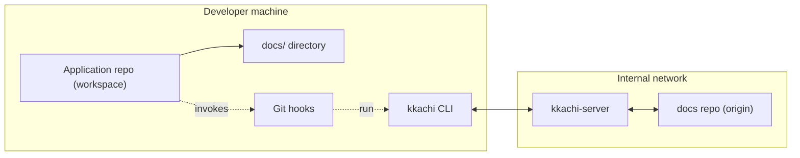

# Kkachi 🐦

> [🇰🇷 한글](https://github.com/SeventeenthEarth/kkachi/blob/main/docs/readme/kor.md)

Kkachi is a **central documentation coordination system** that keeps a single docs repository in sync with the `docs/` directories spread across multiple Git application repositories – without relying on `submodules` or `subtree`.

It consists of a server and a CLI that work together to ensure all participating workspaces share a consistent view of documentation while keeping developers on familiar Git workflows.

---

## Overview

Kkachi is designed for teams that:

- Have multiple Git repositories (backend, frontend, mobile, admin, etc.) sharing **one logical documentation set**.
- Want the **canonical source of truth** for docs to live in a dedicated docs repository.
- Prefer not to introduce `submodules` or `subtree` just to share documentation.
- Want a repeatable, tool-enforced way to detect outdated docs and avoid silent divergence between repos.

Kkachi is composed of two main components:

- **kkachi-server**
  - Central service that clones and manages one or more docs repositories.
  - Exposes REST APIs to read the current docs HEAD, fetch snapshots, and apply updates.
- **kkachi CLI (`kkachi`)**
  - Command-line tool that runs inside each application workspace.
  - Provides commands like `kkachi init`, `kkachi status`, `kkachi fix`, `kkachi hook ...`.
  - Integrates with Git hooks to automatically check documentation state on commit and push.

---

## Architecture 🗺️

The following diagram shows how Kkachi fits into your environment:



- **Application repo** – Your normal code repository (e.g., `sudal`, `sudal_app`).
- **Docs repo** – The dedicated Git repository that stores documentation source (e.g., `sudal_docs`).
- **`docs/` directory** – The working copy of docs inside each application repo.
- **Git hooks** – `pre-commit`, `post-checkout`, `post-merge`, `post-rewrite`, `pre-push`, and `commit-msg` call into `kkachi hook ...`.

Kkachi tracks which docs commit each workspace is based on, compares it against the central docs HEAD, and guides the workflow when changes need to be merged or conflicts resolved.

---

## Why use Kkachi? 🎯

With Kkachi in place:

- **Documentation has a single source of truth.**
  - The canonical history lives in the docs repo.
  - `docs/` in each application repo is a synchronized working copy, not an independent fork.
- **Developers stay on familiar Git flows.**
  - You keep using `git clone`, `git pull`, `git commit`, `git push`.
  - Kkachi adds synchronization and status checks around those flows.
- **No extra Git plumbing to learn.**
  - You don’t need `submodules` or `git subtree` just to share docs.
- **Conflicts are detected early and surfaced clearly.**
  - Kkachi detects outdated bases and performs 3-way merges.
  - Humans still resolve the actual conflict markers, but the tool manages the lifecycle and state.

---

## Key concepts 📚

For full definitions, see `docs/requirement.md`. This is a brief summary:

- **Project**
  - Logical name representing one product or domain (e.g., `sudal`, `dolgorae`).
- **Application repo**
  - A Git repository containing application code.
  - It includes a `docs/` directory that mirrors content from the central docs repo.
- **Docs repo**
  - Dedicated Git repository that stores documentation source and history.
- **Workspace**
  - A local application repo directory that has been initialized with `kkachi init`.
- **kkachi-server**
  - Manages local clones of docs repos and serves snapshot / push APIs.
- **kkachi CLI**
  - Tracks per-workspace state (e.g., base docs hash, pending fixes) via files like `.kkachi.json`, `.kkachi_docs_hash`, `.kkachi_pending_fix`.

From these primitives, Kkachi can always answer:

> “Which docs commit is this workspace based on, and how does that compare to the current HEAD of the docs repo?”

---

## Quick start ⚡

### 1. Run the server

As a team, you deploy **kkachi-server** once. For local development:

**Option 1: Quick start (no hot reload)**
```bash
make build-server-with-web
make run-server-local
```

**Option 2: With hot reload (requires air)**
```bash
# Install air first
go install github.com/air-verse/air@latest

# Run with hot reload
make run-server-dev-local
```

**Option 3: Separate web dev server + server (recommended for development)**
```bash
# Terminal 1: Web dev server (hot reload)
make run-web-local

# Terminal 2: Server
make run-server-local
```

**Option 4: Both servers together**
```bash
make run-local-dev-with-web
```

For a quick test:
```bash
go run ./cmd/server
```

### 2. Initialize a workspace (`kkachi init`)

In each application repository that should participate:

```bash
cd /path/to/your/app-repo

kkachi init \
  --server-url    https://kkachi.example.com \
  --project       sudal \
  --docs-repo-url git@github.com:your-org/sudal_docs.git
```

During `init`, Kkachi will:

- Register the project and workspace with the server.
- Download the current docs snapshot into `docs/`.
- Create workspace metadata files (e.g., `.kkachi.json`, `.kkachi_docs_hash`).
- Install Git hooks that invoke `kkachi hook ...`.

### 3. Day-to-day workflow

Once initialized, your daily flow stays very close to regular Git:

```bash
# Edit docs alongside code
vim docs/guide.md

# Stage changes
git add docs/guide.md

# Commit (pre-commit hook runs kkachi)
git commit -m "Update docs for new feature"

# Push (pre-push hook validates state)
git push origin main
```

On commit/push, Kkachi will:

- Detect whether your docs are based on an outdated commit.
- Attempt to push changes to the central docs repo when appropriate.
- Block pushes when it detects unresolved conflicts or pending fix state, and explain what to do next.

---

## Example workflow 🧪

The following is a typical end-to-end flow:

1. Check current status

   ```bash
   kkachi status
   ```

   You’ll see:
   - The workspace ID.
   - Which docs commit your `docs/` is based on.
   - The current docs HEAD on the server.
   - Overall status (`up_to_date`, `outdated`, etc.) and whether there is a pending fix.

2. Edit docs and commit

   ```bash
   vim docs/feature_x.md

   git add docs/feature_x.md
   git commit -m "Document feature X behavior"
   ```

3. Outdated base detected during pre-commit

   - If someone updated the docs repo first, `kkachi hook pre-commit` detects that your base is outdated.
   - It performs a 3-way merge against the latest docs HEAD.
   - If conflicts occur, Git conflict markers are written into your `docs/` files and the commit is blocked.

4. Resolve conflicts and finalize (`kkachi fix`)

   ```bash
   # Manually resolve conflict markers in docs/...
   vim docs/feature_x.md

   # Once everything is clean:
   kkachi fix
   ```

   `kkachi fix` clears the pending-fix state so that subsequent commits and pushes can proceed normally.

---

## Server Deployment 🚀

### Prerequisites

- **Go** 1.25+
- **Node.js** 22+ (for web UI)
- **npm** (for web UI)
- **Git** available in PATH

Optional for hot reload:
- **air** (`go install github.com/air-verse/air@latest`)

### Development

For local development, use one of these approaches:

**1. Quick development (no hot reload)**
```bash
make build-server-with-web
make run-server-local
```

**2. With hot reload (requires air)**
```bash
make run-server-dev-local
```

**3. Separate web dev server + server (recommended)**
```bash
# Terminal 1
make run-web-local

# Terminal 2
make run-server-local
```

**4. Both servers together**
```bash
make run-local-dev-with-web
```

### Production Deployment

#### Build
```bash
make build-server-with-web
```

This creates:
- Server binary: `bin/server`
- Web dist: `web/dist/`

#### Run
```bash
# Set environment variables
export PORT=5789
export STATE_FILE_PATH=data/kkachi_state.json
export WEB_DIST_DIR=web/dist

# Run server
./bin/server
```

Or use make target:
```bash
make run-server-local
```

### Environment Variables

| Variable | Default | Description |
|----------|---------|-------------|
| `PORT` | `5789` | Server listen port |
| `STATE_FILE_PATH` | `data/kkachi_state.json` | Path to state persistence file |
| `WEB_DIST_DIR` | `web/dist` | Path to web UI build directory (v2) |
| `PTY_DISCONNECT_POLICY` | `terminate` | Action on client disconnect (`terminate`, `stay`) |
| `PTY_MAX_SESSIONS` | `100` | Maximum number of concurrent sessions |
| `PTY_ALLOWED_SHELLS` | `/bin/sh,/bin/bash,/bin/zsh` | Comma-separated list of allowed shells |
| `PTY_DEFAULT_SHELL` | `/bin/sh` | Default shell if not specified |

### Makefile Targets

#### Server
| Target | Description |
|--------|-------------|
| `make run-server-local` | Run server (production binary) |
| `make run-server-dev-local` | Run server with hot reload (requires air) |
| `make build-server-binary` | Build server binary only |
| `make build-server-with-web` | Build web + server together |

#### Web
| Target | Description |
|--------|-------------|
| `make run-web-local` | Run web dev server (hot reload) |
| `make build-web` | Build web UI (production) |
| `make run-local-dev-with-web` | Run web dev server + server together |

#### Testing
| Target | Description |
|--------|-------------|
| `make test-server` | Run full server test suite |
| `make test-web` | Run full web test suite |
| `make test-cli` | Run full CLI test suite |
| `make test-all` | Run all test suites |

#### CLI
| Target | Description |
|--------|-------------|
| `make build-cli` | Build the kkachi CLI binary |
| `make install-cli` | Install CLI to `$GOPATH/bin` |

#### LaunchAgent (macOS)
| Target | Description |
|--------|-------------|
| `make check-github-ssh` | Verify non-interactive GitHub access before installation |
| `make install-launchagent` | Install LaunchAgent for auto-start on login |
| `make status-launchagent` | Show the loaded LaunchAgent status |
| `make uninstall-launchagent` | Uninstall LaunchAgent |

### Deployment Checklist

After deploying, verify:

```bash
# Health check
curl http://localhost:5789/healthz
# Expected: {"ok":true}

# Web UI (SPA)
curl -i http://localhost:5789/
# Expected: 200 and HTML (or a clear error if web dist is missing)

# Web API alias (v2)
curl http://localhost:5789/api/state
# Expected: same JSON as /state

# API state (v1)
curl http://localhost:5789/state
```

---

## Auto-start on macOS Login

Kkachi server can be configured to start automatically when you log in to macOS using a LaunchAgent.

### Install

```bash
make install-launchagent
```

The install target:

- verifies non-interactive access to the current Git origin;
- builds the server and web UI;
- renders a plist with the current checkout and home-directory paths;
- installs it under `~/Library/LaunchAgents/`; and
- starts the service with `launchctl`.

The API server uses port 5789 and the Vite development server uses port 5790 by default. Override `WEB_DEV_PORT` only when an isolated development or test run needs a different port.

The server performs the actual docs repository clone or pull before opening its HTTP port. If the network or SSH credentials are unavailable, startup fails closed and launchd retries after its throttle interval. The launcher does not disable SSH host-key verification or wait forever.

### Verify

```bash
make status-launchagent
curl http://localhost:5789/healthz
curl http://localhost:5790/
```

### Logs

Logs are written to `~/Library/Logs/kkachi/`:
- `kkachi.out.log` — standard output
- `kkachi.err.log` — standard error

### Uninstall

```bash
make uninstall-launchagent
```

---

## Documentation 📖

This README focuses on what Kkachi is and how to use it at a high level.  
For full specifications, error handling rules, and API details, see the documents under `docs/`:

- Requirements and terminology: `docs/requirement.md`

For the Korean introduction to Kkachi, see:

- Korean README: `docs/readme/kor.md`
