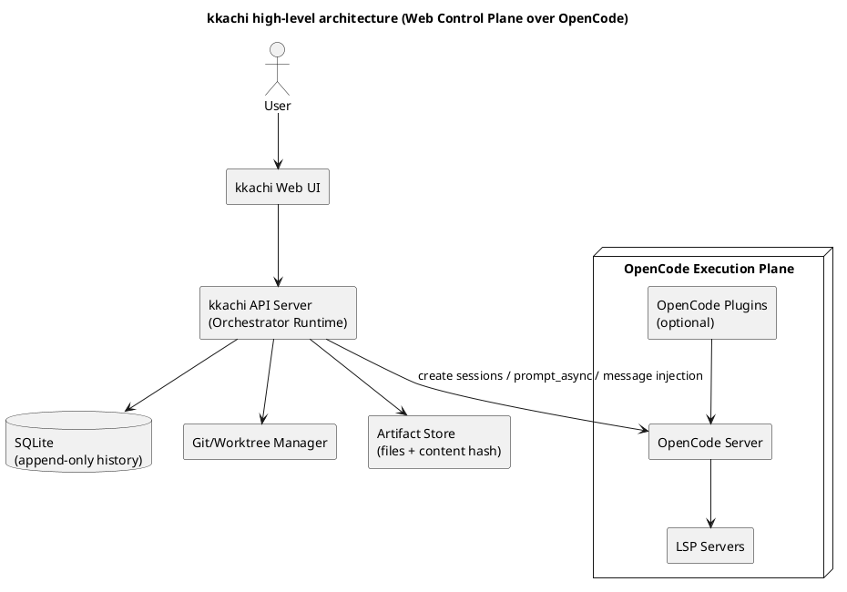
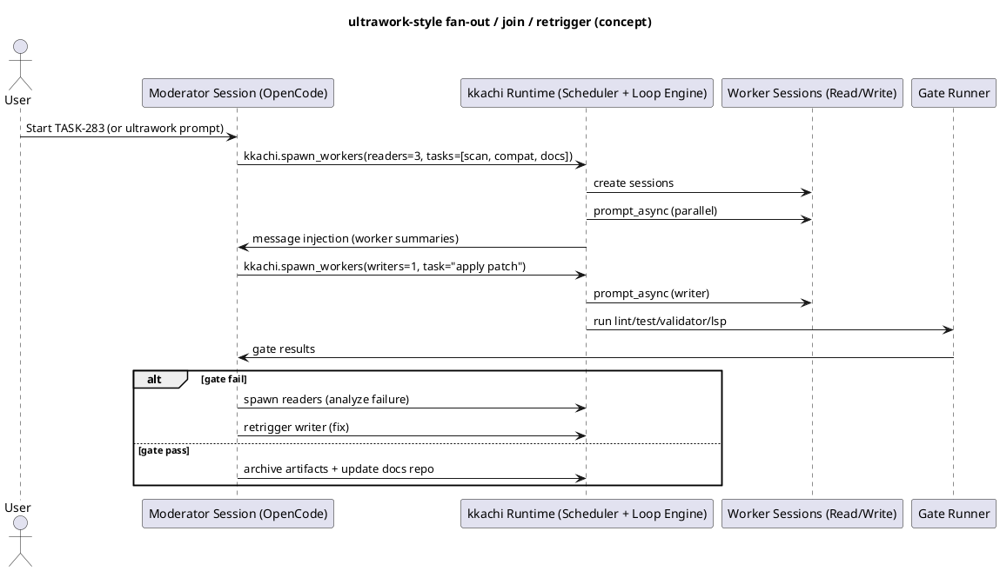
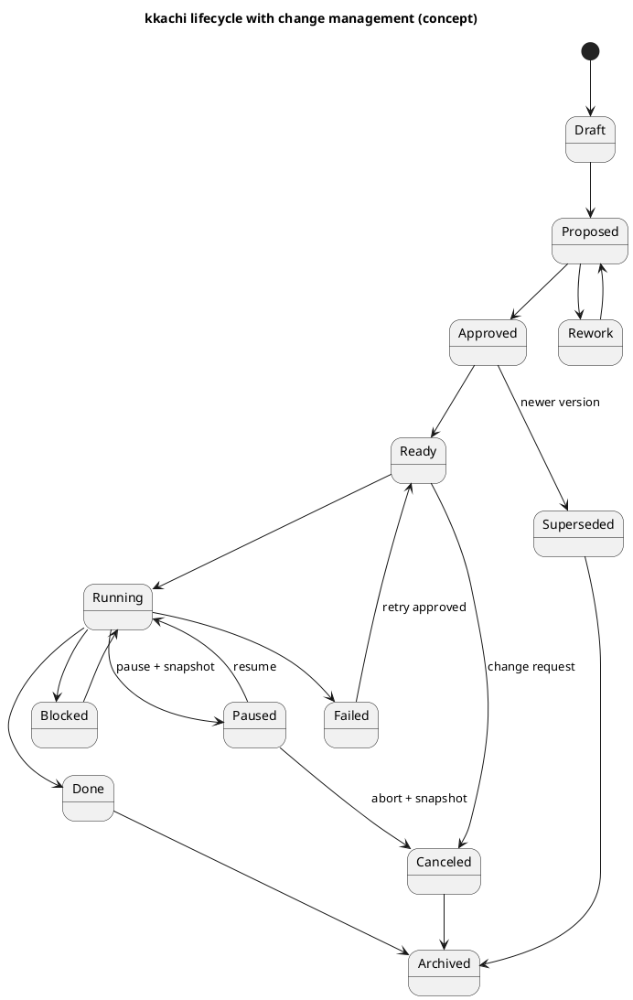

# kkachi 요구사항 정리

## 0. 합의/전제

### 0.1 제품 정체성
- **kkachi = Web-first Control Plane**
  - OpenCode는 **Execution Plane(실행 엔진)** 역할로 둔다.
  - kkachi는 **Orchestration/History/Workspace/Gate/Loop/Approval/UX**를 제공한다.

### 0.2 병렬성에 대한 핵심 결론
- 사용자가 원하는 UX는 “**Moderator 1명에게 맡기면, 알아서 여러 agent를 병렬 운용하고(join/retrigger) Ralph loop로 끝까지 완료**”이다.
- 다만 실행 메커니즘 관점에서는, 현실적으로 병렬 단위가 **(서브에이전트가 아니라) worker session**이 되는 편이 안정적이다.
- 따라서 kkachi는:
  - **Main Moderator session 1개**는 유지하되,
  - 병렬 실행은 **worker session pool**로 fan-out 하고,
  - 완료 결과를 **메시지 주입(message injection)**으로 메인 세션에 되돌린다.

### 0.3 “Sub-moderator” 도입
- Sub-moderator는 **쓰기 주체가 아니라 읽기 전용(critic/arbiter)** 보조 의사결정자로 둔다.
- 목적은 “저렴한 메인 Moderator(예: GLM medium)로 진행하되, 품질 저하로 인한 반복(루프)을 줄이는 것”이다.

### 0.4 플러그인 재사용 전략
- 전부 재구현하지 않는다.
  - OpenCode 코어가 제공하는 기능은 그대로 활용한다.
  - 경쟁 번들(oh-my-opencode)은 **사용하지 않되**, 중립적인 커뮤니티 플러그인은 **선별적으로 채택**한다.

---

## 1. 목적 및 범위

**kkachi(까치)**는 OpenCode를 실행 엔진(Execution Plane)으로 사용하고, 그 위에 Web 기반 컨트롤 플레인(Control Plane)을 구축하는 제품이다.

핵심 목표는 다음과 같다.

- 사용자의 목표를 인터뷰로 구조화해 **Spec, Track, Task**로 설계하고, **승인(Approval)**을 받은 뒤 구현을 진행한다.
- 멀티 리포(server, client, docs)를 하나의 Workspace로 묶어, 코드와 문서 및 작업 이력을 함께 운영한다.
- **Moderator 중심 작업**을 기본으로 하되, 다수의 **worker session**을 병렬로 운용(fan-out, join, retrigger)하여 조사/검증/구현 효율을 높인다.
- **Sub-moderator**로 계획 비평, 리스크 지적, 충돌 중재를 수행해 Ralph loop의 반복 횟수를 줄인다.
- lint, validator, test, LSP diagnostics 기반의 **Gate**와 **Ralph loop**를 결합해 “끝까지 완료”를 자동화한다.
- 완료된 결과물과 로그는 **불변(immutable) history**로 누적하고, SQLite 기반으로 검색 및 분석할 수 있게 한다.

비목표(Non-goals)

- `oh-my-opencode` 번들(에이전트/훅/스킬/설정)을 가져다 쓰지 않는다.

---

## 2. 아키텍처(2-plane): Control Plane + Execution Plane

### 2.1 High-level 컴포넌트

- **kkachi Web UI**: Workspace/Spec/Track/Task, 승인, 실행, 로그/리포트 확인
- **kkachi API Server**: 오케스트레이션 런타임(스케줄러/루프 엔진), DB, 파일 아티팩트 관리
- **SQLite**: append-only 이벤트 로그 + 상태 프로젝션
- **Git/Worktree Manager**: repo/worktree 생성/정리/스냅샷
- **OpenCode Server**: 세션 생성/프롬프트 실행/툴 실행/LSP를 포함한 코드 실행 엔진
- **OpenCode Plugins (optional)**: Tool Search, DCP, PTY 안정화 등

### 2.2 PlantUML: High-level



---

## 3. 핵심 개념(엔티티) 및 저장소 모델

### 3.1 엔티티
- **Workspace**: 여러 Repo를 묶는 작업 단위. 사용자, 모델 라우팅, Gate, 정책을 포함한다.
- **Repo**: server, client, docs 등 개별 저장소.
- **Spec**: 요구사항 및 성공 조건, 제약, 리스크를 담는 최상위 문서.
- **Track**: Spec을 구현하기 위한 큰 작업 흐름(에픽 수준). Task 그래프를 포함.
- **Task**: 실행 가능한 최소 작업 단위(TASK-283 등). repo scope, gate 조건, loop 조건 포함 가능.
- **Run**: Ralph loop의 반복(iteration) 실행 기록.
- **Artifact**: 불변 결과물(리포트, gate 로그, diff 요약, 스냅샷 등).
- **Change Request(CR)**: 피봇/대규모 변경을 모델링하는 1급 엔티티.

### 3.2 저장 전략(2-layer)
- **Mutable layer(진행 상태)**
  - spec.md/plan.md/Task Implementation Spec 등은 작업 중 수정 가능
  - 단, 버전/승인 이벤트를 남김
- **Immutable layer(증거/결과물)**
  - worker 보고서, gate 로그, diff 요약, 스냅샷 등은 **불변(append-only)**

### 3.3 DB 스키마(초안)

> 목적: “무엇을/언제/어떤 모델로/어떤 결과로/어떤 변경을 했는지”를 추적하고, 완료된 기록은 수정 불가로 남김.

- workspaces(id, name, created_at, settings_json)
- repos(id, workspace_id, kind(server|client|docs), path, default_branch, created_at)
- specs(id, workspace_id, title, active_version, created_at)
- spec_versions(spec_id, version, content_hash, created_at, supersedes_version, active_flag)
- tracks(id, workspace_id, spec_id, title, status, active_version, created_at, closed_at)
- track_versions(track_id, version, spec_version, created_at)
- tasks(id, track_id, external_id, title, status, active_version, scope_json, created_at, closed_at)
- task_versions(task_id, version, track_version, spec_hash, loop_spec_json, gate_spec_json, created_at, supersedes_task_id, canceled_reason)
- runs(id, task_id, iteration, started_at, ended_at, outcome, summary_hash)
- worker_tasks(id, run_id, kind(read|write|gate|deliberate), model_ref, repo_id, worktree_path, status, started_at, ended_at, report_hash)
- artifacts(hash, kind, path, size_bytes, created_at, meta_json)
- approvals(id, entity_type(spec|track|task|cr), entity_id, version, approved_by, approved_at, note)
- change_requests(id, workspace_id, type, reason, status, created_at, approved_at)
- events(id, ts, entity_type, entity_id, kind, payload_json, sha256)

불변성 강제(예):
- events/artifacts/archived 영역은 UPDATE/DELETE 금지 트리거
- Done/Archived 상태로 전환된 run/task/version 레코드는 변경 금지(필요 시 새 버전만 생성)

---

## 4. 실행 모델: Moderator + Sub-moderator + Worker Sessions

### 4.1 세션 구성
- **Main Moderator session**
  - 사용자와의 메인 대화
  - fan-out/join/retrigger 및 최종 의사결정
- **Sub-moderator session (read-only)**
  - Critic: 계획/명세 결함·누락·리스크 지적
  - Arbiter: 상충되는 워커 결과의 중재 기준 제시
  - 수렴 전략 제안(반복 실패 시)
- **Reader workers (read-only)**
  - 코드 스캔, 호환성 점검, 문서 검색, 리스크 스캔, 실패 원인 분석 등
- **Writer worker (write 권한)**
  - 실제 변경(diff)을 생성/적용
  - 기본 정책: worktree 당 writer 1
- **Gate runner**
  - lint/validator/test/LSP diagnostics 실행
  - 결과 정규화(지표/로그/리포트 파일) 및 저장

### 4.2 ultrawork UX를 위한 핵심 메커니즘

#### 4.2.1 Main 세션 “1개”를 유지하는 방법
- 사용자 UX는 Moderator 1개로 고정
- 내부적으로는 worker session들이 병렬로 실행
- kkachi가 worker 결과를 **메인 세션으로 message injection**하여 “한 Moderator가 알아서 한 것처럼” 보이게 한다.

#### 4.2.2 kkachi가 OpenCode에 제공해야 하는 커스텀 툴(최소)
- `kkachi.spawn_workers(...)`
- `kkachi.join_workers(...)`
- `kkachi.run_gate(...)`
- `kkachi.worktree_new(...) / kkachi.worktree_snapshot(...) / kkachi.worktree_merge(...)`

> 메인 Moderator는 위 도구를 호출하여 fan-out/join/retrigger를 “직접 제어하는 것처럼” 행동한다.

#### 4.2.3 PlantUML: ultrawork 병렬 오케스트레이션 시퀀스(개념)



### 4.3 병렬 실행 정책(권장 기본값)
- **Writer 1, Readers N**
  - 같은 repo/worktree에서 병렬 writer는 충돌 위험이 크므로 기본적으로 금지
  - 읽기 중심 워커는 병렬 허용
- 병렬 writer가 꼭 필요하면
  - **worktree를 추가로 생성**하고 writer를 분리 배치
  - 최종 선택/병합은 gate로 검증

### 4.4 Sub-moderator의 출력 포맷(정형)
- risks: 실패 가능성이 높은 포인트와 이유
- missing_checks: 누락된 gate/테스트/검증
- plan_improvements: 플랜 개선 제안
- conflict_resolution: 상충 시 선택 기준
- next_actions: 다음 iteration 우선순위

---

## 5. Gate와 Ralph loop

### 5.1 Gate 정의(커맨드 기반이 기본)
프로젝트별로 다음 Gate를 정의할 수 있어야 한다.
- lint
- validator (타입체크, 스키마 검증, 문서 검증 등)
- test
- LSP diagnostics(가능한 경우)

Gate 설정 예시(개념)
| Gate | 예시 커맨드 | Pass 기준 |
|---|---|---|
| lint | `npm run lint` / `golangci-lint run` | exit 0 |
| validator | `npm run typecheck` / `openapi validate` / `buf lint` | exit 0 |
| test | `npm test` / `go test ./...` | exit 0 |
| lsp diagnostics | OpenCode LSP 수집 | count == 0 |

### 5.2 Ralph loop: 종료 조건/반복/병렬 파라미터
- 사용자가 Task 실행 요청 시 다음을 지정할 수 있어야 한다.
  - 종료 조건(until)
  - 최대 반복 횟수(maxIterations)
  - 병렬 worker 수(parallel.maxWorkers)
  - worker 타입 및 모델 믹스(pool)

#### 5.2.1 Loop Spec DSL 예시(텍스트)
```bash
/task "로그인 실패 버그 수정" \
  --until "tests=pass && lint=pass && validator=pass && lsp_diagnostics=0" \
  --max-iter 12 \
  --parallel 3 \
  --workers "gemini:1, glm:1, codex:1"
```

#### 5.2.2 Loop Spec JSON 예시(Web API)
```json
{
  "task": "로그인 실패 버그 수정",
  "loop": {
    "until": {
      "tests": "pass",
      "lint": "pass",
      "validator": "pass",
      "lspDiagnostics": 0
    },
    "maxIterations": 12,
    "parallel": {
      "maxWorkers": 3,
      "pool": [
        {"type": "gemini", "count": 1, "model": "google/gemini-*-*", "variant": "high"},
        {"type": "glm", "count": 1, "model": "zhipu/glm-*", "variant": "high"},
        {"type": "codex", "count": 1, "model": "openai/gpt-5.2-codex", "variant": "high"}
      ]
    }
  }
}
```

---

## 6. 멀티 리포 및 Worktree: 구현 전략 선택지

### 6.1 멀티 리포 Workspace 요구사항
- 하나의 Workspace는 여러 Repo를 등록할 수 있다.
  - server repo
  - client repo
  - docs repo
- Task는 repo scope를 가진다.
  - server only, client only, docs only, server+docs, server+client+docs 등

### 6.2 “동시에 둘 이상의 디렉토리” 처리 전략(옵션 비교)

| 옵션 | 요약 | 장점 | 리스크/단점 | v0.1 권장 |
|---|---|---|---|---|
| A | 상위 폴더 1개에 여러 repo를 물리적으로 넣고, OpenCode를 상위에서 실행 | 단일 세션에서 탐색이 쉬움 | git/LSP 경계가 흐려질 수 있음 | 조건부 |
| B | 외부 디렉토리 접근을 권한으로 허용(예: docs는 read-only) | repo 구조 변경 최소화 | 세션/디렉토리 컨텍스트 이슈 시 위험 | 조건부 |
| C | repo(worktree)별 OpenCode 백엔드(또는 프로젝트 컨텍스트) 분리 + kkachi가 통합 | 경계가 명확, 병렬 운영에 유리 | 컨트롤 플레인 구현 필요 | 기본 권장 |

> 대화에서 반복적으로 강조된 리스크: multi-root/세션 전환에서 cwd/컨텍스트가 어긋나면 파일툴/LSP/명령 실행이 잘못된 repo로 향할 수 있다.

### 6.3 권한 정책 예시(개념)
- server repo 작업 시 docs repo는 read-only 허용
- docs 수정은 docs-scope Task(또는 docs-writer role)에서만 허용

---

## 7. Tool Search(MCP 컨텍스트 절약)

### 7.1 문제 정의
- MCP 서버/도구가 많아질수록, 도구 정의(설명/스키마)가 컨텍스트를 크게 점유한다.
- 해결 목표는 “도구를 전부 넣지 말고, 필요할 때 검색으로 불러오는 지연 로딩(lazy loading)”이다.

### 7.2 구현 옵션

| 옵션 | 구현 방식 | 장점 | 단점 | v0.1 권장 |
|---|---|---|---|---|
| A | OpenCode 플러그인: 메타-툴 패턴(검색/스키마/호출 프록시) | 즉시 도입 가능, 컨텍스트 절감 큼 | OpenCode 기본 mcpServers 운영과 분리될 수 있음 | 가능 |
| B | **kkachi Tool Registry + 메타툴(tool_search/info/call)** | DB(FTS) 기반 검색/분석과 자연스러운 결합 | kkachi 구현량 증가 | 강추 |
| C | OpenCode 코어 기여(자동 defer + 검색 + 확장 로딩) | 가장 자연스러운 UX | 장기, 코어 변경 부담 | 장기 |

### 7.3 플러그인 후보(대화에서 언급된 것)
- **opencode-toolbox**: “tool search tool pattern”을 구현(BM25/regex 검색 + 실행 + 스키마 반환)
- **opencode-mcp-tool-search**: MCP를 직접 tools로 등록하지 않고, 검색/정보/호출 메타툴만 노출하는 방식

> v0.1에서는 플러그인으로 빠르게 효과를 보고, v1.x에서 kkachi DB 기반 Tool Registry로 강화하는 이행도 가능하다.

---

## 8. 플러그인 전략(oh-my-opencode 제외)

> 아래는 “다시 만들기보다 그대로 쓰는 편이 합리적”이라고 논의된 중립 플러그인 후보들이다. v0.1 기본 번들은 최소로 시작하고, 옵션을 단계적으로 추가한다.

### 8.1 후보 플러그인 목록(역할 기준)

| 목적 | 플러그인 후보 | 권장 | kkachi에서 해야 할 일 |
|---|---|---:|---|
| Tool Search(컨텍스트 절감) | opencode-toolbox / opencode-mcp-tool-search | 높음 | 프로젝트별 설정/UX 제공(검색/실행 패널), 향후 kkachi Tool Registry로 확장 |
| 동적 컨텍스트 프루닝 | opencode-dynamic-context-pruning(DCP) | 높음 | Tool Search와 함께 운영(불필요한 도구 출력 축소) |
| 웹서치 + 인용 | opencode-websearch-cited | 옵션 | “근거 포함 조사” 토글/결과 저장(문서 repo/히스토리) |
| 장기 실행/백그라운드 안정화 | opencode-pty | 높음 | 서버 환경에서 long-running 작업 안정화 |
| 셸 커맨드 hang 방지 | opencode-shell-strategy | 높음 | 루프/게이트 실행 안정성 개선 |
| 대형 편집 가속 | opencode-morph-fast-apply | 옵션 | 반복 수정(ralph loop)에서 성능 병목 시 도입 |
| 데스크톱 알림 | opencode-notifier / opencode-notificator | 옵션 | 웹 UI가 있으면 웹 푸시로 대체 가능 |
| 세션 간 개인 메모리 | opencode-supermemory | 옵션 | kkachi 히스토리(DB)와 구분(개인 메모리) |
| 스킬 lazy load | opencode-skillful | 상황별 | kkachi operator/skill 설계와 충돌 여부 검토 |
| md 테이블 정리 | opencode-md-table-formatter | 옵션 | UX 개선(보고서/표 품질) |
| Gemini OAuth(antigravity) | opencode-antigravity-auth 류 | 옵션(주의) | 제공자 정책/ToS 리스크가 있을 수 있으므로 “사용자 책임” 옵션으로 유지 |

---

## 9. OpenCode 통합 디테일(관측/제어)

### 9.1 OpenCode 서버/API 활용 포인트(대화에서 언급)
- 세션 생성/조회/상태
  - `POST /session`
  - `GET /session/status`
- 비동기 실행
  - `POST /session/:id/prompt_async`
- 이벤트 스트림(SSE)
  - `GET /global/event` (또는 유사 엔드포인트)
- 결과 수집
  - `GET /session/:id/diff`
- 메시지 주입(메인 세션에 worker 결과 전달)
  - `POST /session/:id/message`
- 중단
  - `POST /session/:id/abort`

> 주의: 실제 엔드포인트/스키마는 OpenCode 버전에 따라 다를 수 있으므로, v0.1 착수 시 “OpenCode API 계약 확인”을 1차 작업으로 둔다.

### 9.2 OpenCode 플러그인 훅(대화에서 언급된 이벤트 예)
- `tool.execute.before/after`
- `session.*`
- `lsp.*`
- `tui.*`

kkachi는 훅을 다음 목적에 사용한다.
- 관측/로그 수집(도구 호출, 에러, LSP 진단)
- 컨텍스트/규칙 주입(권한/스코프 고정)
- 루프 안전장치(중도 종료 방지 등)

### 9.3 알려진/우려되는 제약(리스크 레지스터)
- MCP 툴 호출이 훅을 일관되게 트리거하지 않을 수 있음 → 중요 이벤트는 서버 이벤트 스트림/SDK 로깅으로 보강
- multi-root/세션 전환에서 cwd/컨텍스트 꼬임 이슈 가능 → 기본 정책은 repo/worktree 경계 고정
- API 동시성 레이스(예: 세션 삭제 레이스) 사례 언급 → 세션 정리 루틴에 확인/재시도 포함
- “Task 기반 subagent”가 REST/serve 모드에서 hang/busy가 될 수 있음 → ultrawork 경험은 worker session pool로 구현
- provider별 variant/effort 체계가 다름 → UI는 공통 레벨(예: low/medium/high/xhigh)을 제공하되 매핑 테이블 필요

---

## 10. 핵심 워크플로우

### 10.1 신규 프로젝트(그린필드)
1) 사용자가 목표 입력: “이런 SW를 만들고 싶다”
2) Interview Mode로 요구사항 수집 및 구조화
3) Spec/Track/Task(의존성 포함 Task Graph) 생성
4) 사용자 승인(Approval Gate)
5) 승인된 순서대로 진행 또는 사용자가 특정 Task를 선택해 실행
6) 완료 시 docs 업데이트 및 history 아카이브

### 10.2 기존 프로젝트(브라운필드) 전환(import → normalize → interview)
1) PRD/Task 목록/진행 문서 입력
2) 문서 파싱 + 코드 분석(LSP, 검색, 테스트)으로 kkachi 포맷으로 변환
3) 문서-코드 갭(누락 요구사항, 불일치, 테스트 부재)을 목록화
4) 부족분만 추가 인터뷰로 보강
5) 사용자 승인 후 실행

### 10.3 Task 실행(예: TASK-283 시작)
1) Moderator가 worker들을 활용하여 컨텍스트 수집
2) Task Implementation Spec 작성 → 사용자에게 제시
3) 사용자 피드백 반영(질의응답)
4) 사용자 승인 후 구현 시작
5) Gate 실행
6) 실패 시 Ralph loop 반복
7) 성공 시 Done 처리 + docs 업데이트 + immutable history 스냅샷

---

## 11. Operator(초기 8개) 정의

v0.1은 아래 8개의 Operator를 기본 역할로 정의한다.

1) **Orchestrator(Moderator)**: 작업 분해, 워커 배치, 루프/게이트 총괄
2) **SpecWriter**: spec/plan 및 Task Implementation Spec 작성, 승인 흐름 지원
3) **Explorer**: LSP/검색 기반 코드 탐색, 원인 규명
4) **CompatChecker**: server-client 계약, API/타입 호환성 점검
5) **Fixer(Writer)**: 작은 변경 위주의 버그/기능 구현
6) **Refactorer(Writer)**: 구조 개선 및 큰 변경(필요 시)
7) **Gatekeeper**: lint/validator/test 실행 및 실패 분석
8) **Reviewer**: 변경 검토, 리스크/추가 TODO 제시

참고
- **Sub-moderator**는 8개 Operator의 별도 역할로 운영한다(읽기 전용).

---

## 12. 모델 라우팅(Agent-Model 가변 연결)

### 12.1 요구사항
- Operator별 모델을 **런타임에 변경** 가능해야 한다.
  - 예: Orchestrator를 Gemini로 쓰다가 GLM으로 변경, Codex로 변경
- OpenAI는 **GPT-5.2**와 **GPT-5.2 Codex** 2개 큰 모델을 지원하며, 각각 `xhigh/high/medium/low` 변형 선택을 지원한다.
- 사용자는 Task 실행 시 아래를 지정할 수 있다.
  - Orchestrator 모델
  - Sub-moderator 모델(Deliberation Mode)
  - worker pool 구성(타입별 개수, 최대 병렬 수)

### 12.2 구현 핵심
- kkachi가 프로젝트/Track/Task/Iteration별 **Routing Policy**를 보유한다.
- 실행 시 OpenCode 세션 프롬프트 호출에 모델 식별자를 동적으로 주입한다.
- 모델 프리셋은 `provider/model + variant` 형태로 관리하고, UI에서 선택한다.

---

## 13. Spec/Track/Task 문서 관리(문서 repo)

### 13.1 문서 원칙
- Spec/Plan은 사람이 리뷰 가능한 Markdown 중심으로 저장한다.
- 작업 중 문서(spec, plan)는 변경 가능하되, 버전화와 승인 이력을 남긴다.
- 완료 후 산출물은 history 영역으로 이동하거나, 불변 스냅샷으로 고정한다.

### 13.2 Spec/Plan 기본 산출물(권장)
- `spec.md`: 목표, 범위, 제약, 성공 조건, 리스크, 비기능 요구사항, gate 기준
- `plan.md`: phases/tasks/subtasks, 의존성, 완료 정의, 롤백/마이그레이션 전략
- `task/<task_id>.md`: Task Implementation Spec(작업 명세서)

### 13.3 Conductor 스타일 “작업 문서”와의 정렬(선택)
- Conductor의 핵심은 “휘발성 채팅 대신, repo에 spec/plan을 남긴다”는 프로토콜이다.
- kkachi는 이 철학을 채택하되, **불변 히스토리는 별도(immutable layer)**로 분리한다.

권장 파일 레이아웃(예)
```
docs-repo/
  tracks/
    TRK-2026-0007/
      spec.v1.md
      plan.v1.md
      spec.v2.md
      plan.v2.md
      tasks/
        TASK-283.md
      history/
        run_0001/
          task_0001_server_scan.md
          task_0002_client_compat.md
          gate_test.log
          gate_lint.log
          summary.json
```

### 13.4 Tag/추적성(선택 기능)
- 코드 변경과 Spec/Task를 연결하기 위한 Tag를 지원한다.
  - 예: 커밋 메시지 또는 코드 주석에 `@SPEC:<track_id>` / `@TASK:<task_id>`
- Gate 단계에서 태그 존재/정합성을 검증하는 옵션을 제공한다.

---

## 14. History(불변 이력)와 분석

### 14.1 목표
- worker 실행, gate 결과, 의사결정, diff 요약 등을 **Task 단위**로 누적 보관한다.
- 완료된 작업은 수정 불가로 고정하고, 나중에 검색 및 분석 가능해야 한다.

### 14.2 저장 단위(권장)
- Human-readable 보고서(필수)
- Machine-readable 메타(필수)
- Raw transcript(선택: 기본 off)

---

## 15. 변경 관리(Change Management, 피봇 지원)

### 15.1 요구사항
- 설계 미스 또는 피봇 요청 시, **이미 Archived된 history는 수정하지 않되**, 아래 대상은 수정/재구성 가능해야 한다.
  - Draft/Proposed/Approved/Ready/Running 상태의 Spec/Track/Task
- 변경은 단순 편집이 아니라 **버전/대체(supersede)**로 모델링한다.

### 15.2 Change Request(CR)
- kkachi는 Change Request를 1급 엔티티로 제공한다.
- CR에는 다음이 포함되어야 한다.
  - 변경 유형(minor/major/pivot/reorder/scope-cut)
  - 변경 사유(Why)
  - 영향 범위(어떤 Spec/Track/Task, 어떤 repo)
  - 영향 분석(취소/대체/추가되는 Task, 의존성 변화)
  - 전환 계획(마이그레이션, 롤백)
  - 변경안 승인

### 15.3 Running Task 처리
- 피봇/대규모 변경 시 Running Task는 다음 옵션을 제공한다.
  - Pause + Snapshot(기본)
  - Abort + Snapshot
  - Salvage(재사용 가능한 변경을 신규 Task로 이관)

### 15.4 UI 지원(필수)
- Change Request Wizard
- Impact Report(변경 전/후 비교, 취소/대체 목록)
- Task Graph Diff
- Approval 기록 및 타임라인

### 15.5 PlantUML: 변경 관리가 포함된 라이프사이클(개념)



---

## 16. Web UI 요구사항

### 16.1 화면 구성(최소)
- Workspace Dashboard
- Spec/PRD View
- Track Board
- Task Detail
- Run Timeline
- History/Archive

### 16.2 UX 원칙
- 사용자는 “Moderator 1명이 끝까지 진행”하는 느낌을 유지한다.
- 병렬 worker는 내부적으로 돌아가되, UI에는 상태(시작/진행/완료)와 핵심 결과만 요약하여 표시한다.
- 승인 없는 대규모 변경은 실행되지 않도록 가드한다(옵션 정책).

---

## 17. 권한/안전장치

- Reader worker와 Sub-moderator는 기본적으로 **read-only**로 동작한다.
- Writer worker만 파일 편집/커밋 권한을 가진다.
- docs repo 수정 권한은 원칙적으로 문서 업데이트 Task(scope=docs)에만 부여한다.
- 외부 디렉토리 접근은 기본 차단 또는 ask 정책으로 운영하며, Workspace에 등록된 repo만 기본 allow로 취급한다.

---

## 18. v0.1 구현 범위(MVP) 재정렬

### 18.1 포함(대화에서 MVP로 반복 등장)
- Web UI: Workspace/Track/Task 목록, Task 실행, 상태/로그/게이트 표시
- Interview Mode: 신규 프로젝트 Spec/Track/Task 생성 및 승인
- Import Mode: 기존 PRD/Task 문서 입력 -> kkachi 포맷 변환 -> 갭 탐지 -> 승인
- Moderator + Sub-moderator + worker session 런타임
- Gate + Ralph loop (사용자 지정 조건, 최대 반복, 병렬 워커, 워커 타입 선택)
- worktree 기반 실행 격리
- SQLite 기반 history(append-only) + docs repo 아티팩트 저장
- Change Request 기반 피봇 지원(버전/대체, 영향 분석, 재승인)
- Tool Search 기본 기능(검색 -> 상세 -> 호출)

### 18.2 제외 또는 옵션(초기에는 얇게)
- 고급 병렬 writer(자동 병합/충돌 해결) 완전화
- 고급 자동 릴리즈/배포 파이프라인
- 외부 시스템(Jira, Linear 등)과의 양방향 동기화

---

## 19. “대화에서 나온 플러그인/선택지” 정리 (누락 보강)

### 19.1 재사용을 고려한 플러그인 후보(요약)
- Tool Search: opencode-toolbox / opencode-mcp-tool-search
- Web search + citations: opencode-websearch-cited
- Context pruning: opencode-dynamic-context-pruning
- Background/long-running 안정화: opencode-pty, opencode-shell-strategy
- UX 보조: opencode-md-table-formatter, opencode-notifier/notificator
- 편집 성능: opencode-morph-fast-apply
- (주의) 인증: opencode-antigravity-auth 류

### 19.2 “우리가 직접 구현”으로 합의된 핵심(경쟁력)
- Web UI + API(제품)
- Workspace(멀티 repo) 개념과 운영
- SQLite 불변 히스토리 + 분석
- Ralph loop + Gate 파이프라인
- ultrawork 경험(Moderator 중심 fan-out/join/retrigger)
- Sub-moderator(Deliberation Mode)
- Tool Search의 UX/정책/분석(플러그인 채택 여부와 무관하게)

---

## 20. Assistant 질문 이력(대화에서 나온 “유효 질문” 정리)

> 사용자가 요청한 “매 대답마다 나왔던 질문”을, 설계 결정을 위해 의미 있는 것만 추려서 정리한다.

### 20.1 아직 결정을 내려야 하는 질문(미결)
1) **MoAI 계열 기능의 MVP 포함 범위**
   - SPEC/Plan-Run-Sync, Tag 추적성, worktree 운영 명령군을 v0.1에 어디까지 포함할지
   - (A) 이미 다 포함한 것 같은데, 부족한 부분이 있나?
2) **Ralph loop 기본 종료 조건/실패 정책**
   - 기본 until 조합(`tests/lint/validator/lsp_diagnostics`)과 실패 시 정책
   - (A) 어떤 부분을 정의해야 하는거지?
3) **문서 repo 구조(배치 위치/표준 디렉터리)**
   - `conductor/` 호환으로 갈지, kkachi 고유 구조로 갈지
   - (A) Kkachi 고유 구조로 가자.
4) **Gate 기본값 제공 방식**
   - 언어별 프리셋(JS/TS, Go 등)을 제공할지 vs 프로젝트 커맨드만 지원할지
   - (A) 먼저 프로젝트 커맨드만 지원하고 이후에 언어별 프리셋 지원
5) **Task ID 체계**
   - 기존 `TASK-283` 같은 ID를 그대로 1급으로 유지할지 vs kkachi ID를 새로 만들고 매핑할지
   - (A) 'TASK-283' 같은 형식의 아이디를 사용하자.
6) **Approval Gate 단계 수**
   - Spec 베이스라인 승인만 vs Task Implementation Spec 승인까지 필수 vs Merge/Release 전 승인
   - (A) Spec, Task, Merge, Release 모두 사용자 승인 필요
7) **병렬 writer 허용 범위(기본 정책)**
   - worktree 당 writer 1 고정 vs 조건부 sub-worktree writer 병렬 허용
   - (A) worktree 당 writer 1 고정
8) **Tool Search 구현 선택(v0.1)**
   - kkachi Tool Registry를 v0.1부터 직접 구축할지 vs 기존 플러그인 채택 + kkachi UX/설정만 관리할지
   - (A) 이건 sqlite3 를 직접 만드는게 효율적이라고 했던 것 같은데. 맞으면 직접 구현
9) **v0.1 기본 플러그인 번들 범위**
   - DCP/PTY/shell-strategy/websearch-cited/morph-fast-apply/notifier/supermemory/skillful 등 포함 범위
   - (A) 전부 다
10) **Change Management 정책(세부)**
   - 어떤 변경이 재승인을 요구하는가
   - Running Task 기본 처리(Pause+Snapshot vs 즉시 Abort 허용)
   - 버전 네이밍 규칙(Spec vN/Plan vN/Task vN)
   - (A) Running task가 있는 경우, 계속 진행할지 또는 abort 할지 사용자가 결정
11) **멀티 repo 실행 전략 기본값**
   - 옵션 C(repo/worktree별 OpenCode 백엔드 분리)를 기본으로 고정할지, MVP에서 옵션 A(상위 폴더 방식)를 먼저 갈지
   - repo/worktree별 opencode 백엔드 분리

### 20.2 이미 방향이 잡힌 질문(결정됨/합의됨)
- “oh-my-opencode를 가져다 쓸 것인가?” → **아니오(비목표)**
- “Sub-moderator를 넣을 것인가?” → **예(조건부 개입, read-only)**
- “ultrawork UX를 지원할 것인가?” → **예(Moderator 중심 + worker session 병렬)**, 단 이름은 ultrawork 대신 allatonce(=aao) 로 하자.
- “완료된 history는 불변으로 둘 것인가?” → **예(append-only + snapshot)**

---

## 21. 추가 및 확인 필요 사항

1) 동일 agent worker를 한 moderator가 병렬로 여러개 생성 가능한가?

2) 기본적인 work process: Task 설계 요청. 애매하거나 사용자의 결정이 필요한 부분이 있었는지 인터뷰. 구현 작업 진행. 충분한 테스트(happy & 중요 edge case) 추가. 코드 중복 및 최적화 작업. 문서 업데이트.

3) 하나의 workspace에서 둘 이상의 작업을 동시에 할 수 있나? 하나는 TASK-132, 다른 하나는 TASK-198 이렇게

4) oh-my-claude-sisyphus와 oh-my-opencode를 참고해서 추가할 agent들은 없을까?

5) moderator, sub-moderator, worker 들의 AI model 변경은 어떻게 하지? 한번 세션이 시작하면 변경을 할 수 없을까?

6) 10인 이하의 조직에서 하나의 kkachi 서버를 함께 사용해서 협업할 수 있을까?

7) 각 Track과 Task 들 사이에서 선후 관계를 표시하면 좋을 것 같음

8) A project를 진행하면서 server repo, client repo, docs repo 세개의 repo를 운영할 때, B workspace 는 server rpo와 docs repo를, C workspace는 client repo와 docs repo를 포함한다고 했을 때, B workspace에서 docs repo를 업데이트하고 merge 했을 때 C workspace에서는 주기적으로 docs repo를 따로 fetch/rebase를 할 필요 없는거지? 둘다 물리적으로 같은 docs repo 디렉토리를 보니까 말이야. 맞는지 확인해줘.

## References

- <https://github.com/modu-ai/moai-adk?tab=readme-ov-file>
- <https://github.com/Yeachan-Heo/oh-my-claude-sisyphus>
- <https://github.com/code-yeongyu/oh-my-opencode>
- <https://github.com/gemini-cli-extensions/conductor>
