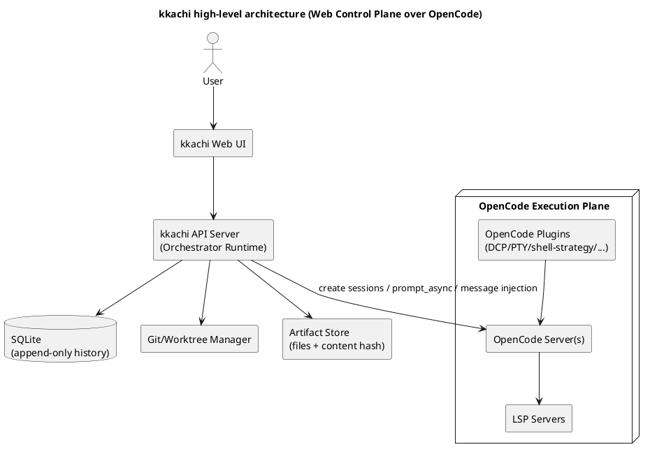
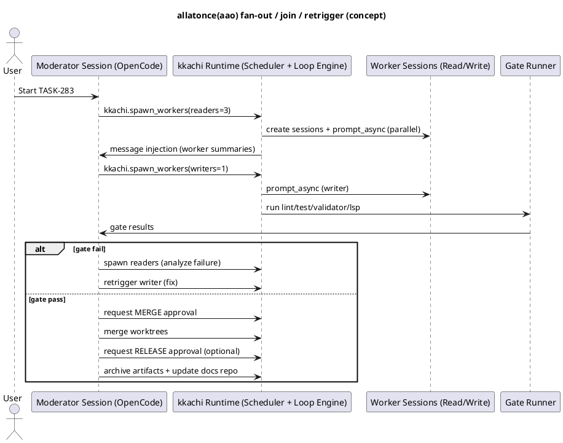
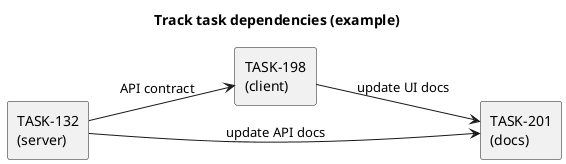

# kkachi v0.3 요구사항 정리 (대화 기반 + 사용자 답변 반영)

- Source: `interview_for_kkachi.pdf` 전체 대화 + 사용자가 수정한 `kkachi_v0_2.md`를 기준으로, **사용자 답변(섹션 20)과 추가 질문(섹션 21)**을 반영해 보강한 버전
- Non-goals: `oh-my-opencode` 번들(에이전트/훅/스킬/설정)을 가져다 쓰지 않는다(경쟁 프로젝트로 간주)

---

## 0. v0.3에서 확정된 합의/전제(업데이트)

### 0.1 제품 정체성
- **kkachi = Web-first Control Plane**
  - OpenCode는 **Execution Plane(실행 엔진)** 역할
  - kkachi는 **Orchestration/History/Workspace/Gate/Loop/Approval/UX**를 제공

### 0.2 병렬성에 대한 핵심 결론
- 사용자가 원하는 UX는 “**Moderator 1명에게 맡기면, 알아서 여러 agent를 병렬 운용하고(join/retrigger) Ralph loop로 끝까지 완료**”이다.
- 다만 실행 메커니즘 관점에서 병렬 단위는 **(서브에이전트가 아니라) worker session**이 안정적이다.
- 따라서 kkachi는:
  - **Main Moderator session 1개**는 유지
  - 병렬 실행은 **worker session pool**로 fan-out
  - 완료 결과를 **message injection**으로 메인 세션에 되돌림

### 0.3 “Sub-moderator(Deliberation Mode)” 도입
- Sub-moderator는 **쓰기 주체가 아니라 읽기 전용(critic/arbiter)** 보조 의사결정자로 둔다.
- 목적은 “저렴한 메인 Moderator(예: GLM medium)로 진행하되, 품질 저하로 인한 반복(루프)을 줄이는 것”이다.

### 0.4 용어 정리: allatonce(aao)
- 대화에서 말한 ultrawork UX는 v0.3 문서에서 **allatonce(=aao)** 로 표기한다.
  - 의미: Moderator 중심 fan-out/join/retrigger UX

### 0.5 사용자 답변으로 “확정”된 정책(중요)
- **문서 repo 구조**: `conductor/` 호환보다 **kkachi 고유 구조** 채택
- **Gate 기본값**: v0.1은 **프로젝트 커맨드 기반**만 먼저 지원하고, 언어별 프리셋은 이후 추가
- **Task ID**: `TASK-283` 같은 **기존 형식 유지**
- **Approval Gate 단계**: **Spec, Task, Merge, Release 모두 사용자 승인 필요**
- **Writer 병렬 정책**: **worktree 당 writer 1 고정**(기본)
- **Tool Search**: v0.1부터 **SQLite 기반 Tool Registry를 kkachi에서 직접 구현**(플러그인은 보조 수단)
- **v0.1 기본 플러그인 번들**: DCP/PTY/shell-strategy/websearch-cited/morph-fast-apply/notifier(or notificator)/supermemory/skillful 등 **모두 포함**
- **멀티 repo 실행 기본값**: **repo/worktree별 OpenCode 백엔드 분리(옵션 C)**
- **Change Management**: Running task가 있을 때 **계속 진행 vs abort는 사용자가 결정**

---

## 1. 목적 및 범위

**kkachi(까치)**는 OpenCode를 실행 엔진(Execution Plane)으로 사용하고, 그 위에 Web 기반 컨트롤 플레인(Control Plane)을 구축하는 제품이다.

핵심 목표:
- 사용자의 목표를 인터뷰로 구조화해 **Spec, Track, Task**로 설계하고, **승인(Approval)**을 받은 뒤 구현을 진행
- 멀티 리포(server, client, docs)를 하나의 Workspace로 묶어, 코드/문서/작업 이력을 함께 운영
- **Moderator 중심 작업**을 기본으로 하되, 다수의 **worker session**을 병렬 운용(fan-out, join, retrigger)하여 조사/검증/구현 효율을 높임
- **Sub-moderator(Deliberation Mode)** 로 계획 비평, 리스크 지적, 충돌 중재를 수행해 Ralph loop 반복 횟수를 줄임
- lint, validator, test, LSP diagnostics 기반의 **Gate**와 **Ralph loop**를 결합해 “끝까지 완료”를 자동화
- 완료된 결과물과 로그는 **불변(immutable) history**로 누적하고, SQLite 기반으로 검색/분석 가능하게 함

비목표(Non-goals)
- `oh-my-opencode` 번들(에이전트/훅/스킬/설정)을 가져다 쓰지 않는다

---

## 2. 아키텍처(2-plane): Control Plane + Execution Plane

### 2.1 High-level 컴포넌트
- **kkachi Web UI**: Workspace/Spec/Track/Task, 승인, 실행, 로그/리포트 확인
- **kkachi API Server**: 오케스트레이션 런타임(스케줄러/루프 엔진), DB, 파일 아티팩트 관리
- **SQLite**: append-only 이벤트 로그 + 상태 프로젝션
- **Git/Worktree Manager**: repo/worktree 생성/정리/스냅샷/병합
- **OpenCode Server(s)**: 세션 생성/프롬프트 실행/툴 실행/LSP 포함 코드 실행 엔진
- **OpenCode Plugins (v0.1 기본 번들 포함)**: DCP, PTY, shell-strategy, websearch-cited 등

### 2.2 PlantUML: High-level



---

## 3. 핵심 개념(엔티티) 및 저장소 모델

### 3.1 엔티티
- **Workspace**: 여러 Repo를 묶는 작업 단위. 사용자/권한, 모델 라우팅, Gate, 정책 포함
- **Repo**: server, client, docs 등 개별 저장소
- **Spec**: 요구사항 및 성공 조건, 제약, 리스크를 담는 최상위 문서
- **Track**: Spec을 구현하기 위한 큰 작업 흐름(에픽 수준). Task 그래프(DAG) 포함
- **Task**: 실행 가능한 최소 작업 단위(`TASK-283` 등). repo scope, gate 조건, loop 조건 포함 가능
- **Task Dependency Edge**: Task 간 선후 관계(의존성)
- **Run**: Ralph loop의 iteration 실행 기록
- **Worker Job**: reader/writer/gate/sub-moderator 작업 실행 단위
- **Artifact**: 불변 결과물(리포트, gate 로그, diff 요약, 스냅샷 등)
- **Change Request(CR)**: 피봇/대규모 변경을 모델링하는 1급 엔티티
- **Approval**: Spec/Task/Merge/Release/CR 등에 대한 사용자 승인 이벤트

### 3.2 저장 전략(2-layer)
- **Mutable layer(진행 상태)**
  - spec/plan/Task Implementation Spec 문서는 작업 중 수정 가능
  - 단, 버전과 승인 이벤트를 남김
- **Immutable layer(증거/결과물)**
  - worker 보고서, gate 로그, diff 요약, 스냅샷 등은 **append-only**

### 3.3 DB 스키마(초안, v0.3 업데이트)

> 목적: “무엇을/언제/어떤 모델로/어떤 결과로/어떤 변경을 했는지” 추적. 완료된 기록은 수정 불가.

핵심 테이블(예시)
- workspaces(id, name, created_at, settings_json)
- repos(id, workspace_id, kind(server|client|docs), origin_url, local_path, default_branch, created_at)
- users(id, email, display_name, created_at, last_login_at)
- workspace_members(workspace_id, user_id, role(owner|maintainer|writer|reader|auditor), created_at)

- specs(id, workspace_id, title, active_version, created_at)
- spec_versions(spec_id, version, content_hash, created_at, supersedes_version, active_flag)

- tracks(id, workspace_id, spec_id, title, status, active_version, created_at, closed_at)
- track_versions(track_id, version, spec_version, created_at)

- tasks(id, track_id, external_id, title, status, active_version, scope_json, created_at, closed_at)
- task_versions(task_id, version, track_version, spec_hash, loop_spec_json, gate_spec_json, created_at, supersedes_task_id, canceled_reason)
- task_deps(task_id, depends_on_task_id, created_at)

- runs(id, task_id, iteration, started_at, ended_at, outcome, summary_hash)
- worker_jobs(id, run_id, kind(read|write|gate|deliberate), operator, model_ref, repo_id, worktree_path, status, started_at, ended_at, report_hash)

- artifacts(hash, kind, path, size_bytes, created_at, meta_json)
- approvals(id, entity_type(spec|task|merge|release|cr), entity_id, version, approved_by_user_id, approved_at, note)

- change_requests(id, workspace_id, type, reason, status, created_at, approved_at)
- events(id, ts, entity_type, entity_id, kind, payload_json, sha256)

불변성 강제(예)
- events/artifacts/history 영역은 UPDATE/DELETE 금지 트리거
- Done/Archived로 전환된 run/task_version 레코드는 변경 금지(새 버전만 생성)

---

## 4. 실행 모델: Moderator + Sub-moderator + Worker Sessions

### 4.1 세션 구성
- **Main Moderator session**
  - 사용자와 메인 대화
  - fan-out/join/retrigger 및 최종 의사결정
- **Sub-moderator session (read-only)**
  - 계획/명세 결함, 누락, 리스크 지적
  - 상충되는 워커 결과의 중재 기준 제시
  - 반복 실패 시 수렴 전략 제안
- **Reader workers (read-only)**
  - 코드 스캔, 호환성 점검, 문서 검색, 리스크 스캔, 실패 원인 분석
- **Writer worker (write 권한)**
  - 실제 변경(diff) 생성/적용
  - 기본 정책: worktree 당 writer 1
- **Gate runner**
  - lint/validator/test/LSP diagnostics 실행
  - 결과 정규화 및 저장

### 4.2 allatonce(aao) UX를 위한 핵심 메커니즘

#### 4.2.1 Main 세션 “1개”를 유지하는 방법
- 사용자 UX는 Moderator 1개로 고정
- 내부적으로 worker session들이 병렬 실행
- kkachi가 worker 결과를 **message injection**으로 메인 세션에 주입해 “한 Moderator가 알아서 한 것처럼” 보이게 함

#### 4.2.2 kkachi가 OpenCode에 제공해야 하는 커스텀 툴(최소)
- `kkachi.spawn_workers(...)`
- `kkachi.join_workers(...)`
- `kkachi.run_gate(...)`
- `kkachi.worktree_new(...) / kkachi.worktree_snapshot(...) / kkachi.worktree_merge(...)`

#### 4.2.3 PlantUML: allatonce(aao) 시퀀스(개념)



### 4.3 병렬 실행 정책(기본값)
- **Writer 1, Readers N**
  - 같은 repo/worktree에서 병렬 writer는 충돌 위험이 크므로 기본 금지
  - 읽기 워커는 병렬 허용
- 병렬 writer가 꼭 필요하면
  - worktree를 추가 생성해 writer를 분리 배치
  - 최종 선택/병합은 gate로 검증

### 4.4 Sub-moderator 출력 포맷(정형)
- risks: 실패 가능 포인트와 이유
- missing_checks: 누락된 gate/테스트/검증
- plan_improvements: 플랜 개선 제안
- conflict_resolution: 상충 시 선택 기준
- next_actions: 다음 iteration 우선순위

---

## 5. Gate와 Ralph loop

### 5.1 Gate 정의(커맨드 기반이 v0.1 기본)
프로젝트별로 다음 Gate를 정의할 수 있어야 한다.
- lint
- validator (타입체크, 스키마 검증, 문서 검증 등)
- test
- LSP diagnostics(가능한 경우)

#### 5.1.1 v0.1 Gate 설정 방식(확정)
- **v0.1은 “프로젝트 커맨드”만 지원**한다.
- 언어별 프리셋(JS/TS, Go 등)은 v1.x에서 추가한다.

Gate 설정 예시(개념)

| Gate | 예시 커맨드 | Pass 기준 |
|---|---|---|
| lint | `npm run lint` / `golangci-lint run` | exit 0 |
| validator | `npm run typecheck` / `openapi validate` / `buf lint` | exit 0 |
| test | `npm test` / `go test ./...` | exit 0 |
| lsp diagnostics | OpenCode LSP 수집 | count == 0 |

Gate 설정 파일 예시(초안)
```json
{
  "gates": {
    "lint": {"cmd": "npm run lint"},
    "validator": {"cmd": "npm run typecheck"},
    "test": {"cmd": "npm test"},
    "lspDiagnostics": {"max": 0}
  }
}
```

### 5.2 Ralph loop: 종료 조건/반복/병렬 파라미터
- 사용자가 Task 실행 요청 시 다음을 지정할 수 있어야 한다.
  - 종료 조건(until)
  - 최대 반복 횟수(maxIterations)
  - 병렬 worker 수(parallel.maxWorkers)
  - worker 타입 및 모델 믹스(pool)

#### 5.2.1 Loop Spec DSL 예시(텍스트)
```bash
/task "로그인 실패 버그 수정" \
  --until "tests=pass && lint=pass && validator=pass && lsp_diagnostics=0" \
  --max-iter 12 \
  --parallel 3 \
  --workers "gemini:1, glm:1, codex:1"
```

#### 5.2.2 Loop Spec JSON 예시(Web API)
```json
{
  "task": "로그인 실패 버그 수정",
  "loop": {
    "until": {
      "tests": "pass",
      "lint": "pass",
      "validator": "pass",
      "lspDiagnostics": 0
    },
    "maxIterations": 12,
    "parallel": {
      "maxWorkers": 3,
      "pool": [
        {"type": "gemini", "count": 1, "model": "google/gemini-*-*", "variant": "high"},
        {"type": "glm", "count": 1, "model": "zhipu/glm-*", "variant": "high"},
        {"type": "codex", "count": 1, "model": "openai/gpt-5.2-codex", "variant": "high"}
      ]
    }
  }
}
```

### 5.3 실패 정책(권장 기본)
- Gate 실패: iteration을 증가시키며 자동 재시도
- maxIterations 도달: `Failed`로 종료하되,
  - 실패 원인 요약(Top-N)
  - 마지막 gate 결과
  - 재시도 전략(예: 모델/워커 믹스 변경, scope 분할)
  - 변경 필요 시 CR(변경 요청) 제안
  을 **report artifact**로 남긴다.

---

## 6. 멀티 리포 및 Worktree

### 6.1 멀티 리포 Workspace 요구사항
- 하나의 Workspace는 여러 Repo를 등록할 수 있다.
  - server repo
  - client repo
  - docs repo
- Task는 repo scope를 가진다.
  - server only, client only, docs only, server+docs, server+client+docs 등

### 6.2 “동시에 둘 이상의 디렉토리” 처리 전략(옵션 비교)

| 옵션 | 요약 | 장점 | 리스크/단점 | v0.1 |
|---|---|---|---|---|
| A | 상위 폴더 1개에 여러 repo를 물리적으로 넣고, OpenCode를 상위에서 실행 | 단일 세션에서 탐색이 쉬움 | git/LSP 경계가 흐려질 수 있음 | 보조 수단 |
| B | 외부 디렉토리 접근을 권한으로 허용(예: docs는 read-only) | repo 구조 변경 최소화 | 세션/디렉토리 컨텍스트 이슈 시 위험 | 보조 수단 |
| C | **repo(worktree)별 OpenCode 백엔드 분리 + kkachi가 통합** | 경계 명확, 병렬 운영 유리 | 컨트롤 플레인 구현 필요 | **기본값(확정)** |

### 6.3 Worktree 기반 격리(기본)
- Track 또는 Task 실행 시, repo별로 worktree를 생성해 격리
- writer worker는 해당 worktree 범위에서만 쓰기 가능
- 완료 시 merge 승인 후 기본 브랜치로 병합

#### 6.3.1 예시: server + docs 동시 작업
- server repo: `wt/TRK-2026-0007/server`
- docs repo: `wt/TRK-2026-0007/docs`
- Gate: server(test/lint) + docs(validator: markdown lint, link check)

### 6.4 한 Workspace에서 둘 이상의 Task 동시 진행(동시성 모델)
- 가능하다. 단, 충돌 방지를 위해 기본 정책은 아래로 고정한다.
  - **Task마다 worktree를 분리**
  - **worktree 당 writer 1**
  - Gate는 Task별로 독립 수행
  - merge는 승인 후 순차(또는 repo별 병렬) 수행

예시
- TASK-132: server repo 변경 (server worktree A)
- TASK-198: client repo 변경 (client worktree B)
- 두 Task는 서로 다른 repo/worktree면 동시 실행 가능

### 6.5 “docs repo를 여러 Workspace가 공유”할 때의 동작 규칙
- kkachi 서버 관점에서 docs repo는 보통 다음 중 하나로 운영된다.

| 운영 방식 | 의미 | C workspace가 별도 fetch/rebase가 필요한가 |
|---|---|---|
| (1) 동일 clone + worktree 공유(서버 내부) | kkachi가 하나의 docs repo clone을 관리하고, 작업은 worktree로 분기 | 네트워크 fetch는 불필요. 다만 **다른 worktree가 main에 merge한 커밋을 내 worktree에 반영하려면 merge/rebase가 필요** |
| (2) Workspace마다 별도 clone | server/client/docs를 Workspace별로 각자 clone | 원격(origin)에서 fetch/pull 필요 |

v0.1 기본값 권장
- (1) **서버 내부에서 동일 clone을 공유하고, Track/Task마다 worktree를 생성**
- 그리고 kkachi가 아래를 자동화
  - main 브랜치 fast-forward 갱신
  - 새 worktree는 항상 최신 main 기준에서 생성
  - 다른 worktree에서 main으로 merge가 발생하면, 영향받는 worktree에 “업데이트 필요” 이벤트를 남기고 사용자에게 선택지 제공

---

## 7. Tool Search(MCP 컨텍스트 절약)

### 7.1 문제 정의
- MCP 서버/도구가 많아질수록 도구 정의(설명/스키마)가 컨텍스트를 크게 점유
- 목표: “도구를 전부 넣지 말고, 필요할 때 검색으로 불러오는 지연 로딩(lazy loading)”

### 7.2 v0.1 구현 방향(확정)
- kkachi가 **SQLite(FTS) 기반 Tool Registry**를 직접 구축한다.
- OpenCode 세션에는 최소 메타툴만 노출한다.
  - `tool_search(query, tags, provider, mcp_server)`
  - `tool_info(tool_id)`
  - `tool_call(tool_id, args)`

#### 7.2.1 Tool Registry 저장(예시)
- tools(id, name, description, schema_json, tags_json, provider, mcp_server, updated_at)
- tool_aliases(tool_id, alias)
- tool_usage_stats(tool_id, used_count, last_used_at)

#### 7.2.2 tool_search API 예시
- 입력: `"openapi validate"`, tags=`["validator"]`
- 출력: tool_id 목록 + 간단 요약
- tool_info: 선택한 tool_id의 전체 JSON schema 반환

### 7.3 OpenCode 플러그인/스킬과의 관계
- OpenCode 플러그인(opencode-toolbox 등)은 “패턴 참고” 또는 “초기 부트스트랩” 용도로만 활용 가능
- v0.1의 정본은 kkachi Tool Registry이며, kkachi가 검색 결과/사용 로그를 history에 남긴다.

---

## 8. 플러그인 전략(oh-my-opencode 제외)

### 8.1 v0.1 기본 번들(확정)

| 목적 | 플러그인 | 비고 |
|---|---|---|
| 동적 컨텍스트 프루닝 | opencode-dynamic-context-pruning(DCP) | 툴 출력/로그 정리로 토큰 절감 |
| 웹서치 + 인용 | opencode-websearch-cited | 조사 근거를 아티팩트로 보존 |
| 장기 실행 안정화 | opencode-pty | 서버 환경 long-running 안정화 |
| 셸 hang 방지 | opencode-shell-strategy | Gate/루프 신뢰성 개선 |
| 대형 편집 가속 | opencode-morph-fast-apply | 반복 수정 성능 개선 |
| 알림 | opencode-notifier 또는 opencode-notificator | Web UI 알림과 병행 가능 |
| 세션 간 개인 메모리 | opencode-supermemory | kkachi 히스토리와 별도(개인) |
| 스킬 lazy load | opencode-skillful | Operator를 스킬로 배포 시 유리 |
| md 테이블 정리 | opencode-md-table-formatter | 보고서 품질 개선 |

### 8.2 인증 플러그인(주의)
- opencode-antigravity-auth 류는 제공자 정책/ToS 리스크가 있을 수 있으므로 v0.1 기본 번들에는 넣지 않고, **사용자 책임 옵션**으로 둔다.

---

## 9. OpenCode 통합 디테일(관측/제어)

### 9.1 OpenCode 서버/API 활용 포인트(대화에서 언급)
- 세션 생성/조회/상태
  - `POST /session`
  - `GET /session/status`
- 비동기 실행
  - `POST /session/:id/prompt_async`
- 이벤트 스트림(SSE)
  - `GET /global/event` (또는 유사 엔드포인트)
- 결과 수집
  - `GET /session/:id/diff`
- 메시지 주입(메인 세션에 worker 결과 전달)
  - `POST /session/:id/message`
- 중단
  - `POST /session/:id/abort`

> 실제 엔드포인트/스키마는 OpenCode 버전에 따라 다를 수 있으므로, v0.1 착수 시 “OpenCode API 계약 확인”을 1차 작업으로 둔다.

### 9.2 OpenCode 플러그인 훅(이벤트 예)
- `tool.execute.before/after`
- `session.*`
- `lsp.*`
- `tui.*`

kkachi는 훅을 다음 목적에 사용한다.
- 관측/로그 수집(도구 호출, 에러, LSP 진단)
- 컨텍스트/규칙 주입(권한/스코프 고정)
- 루프 안전장치

---

## 10. 핵심 워크플로우

### 10.1 신규 프로젝트(그린필드)
1) 사용자가 목표 입력
2) Interview Mode로 요구사항 수집 및 구조화
3) Spec/Track/Task(의존성 포함 Task Graph) 생성
4) **Spec 승인(Approval Gate)**
5) 승인된 순서대로 진행 또는 사용자가 특정 Task 선택
6) 완료 시 docs 업데이트 및 history 아카이브

### 10.2 기존 프로젝트(브라운필드) 전환(import → normalize → interview)
1) PRD/Task 목록/진행 문서 입력
2) 문서 파싱 + 코드 분석(LSP, 검색, 테스트)으로 kkachi 포맷 변환
3) 문서-코드 갭(누락 요구사항, 불일치, 테스트 부재) 목록화
4) 부족분만 추가 인터뷰로 보강
5) **Spec 승인** 후 실행

### 10.3 Task 실행(예: TASK-283)

#### 10.3.1 표준 프로세스(SOP, v0.1 기본)
1) Task 설계 요청 접수
2) 애매하거나 사용자 결정이 필요한 부분 인터뷰
3) Task Implementation Spec(TIS) 작성
4) **Task 승인(Approval Gate)**
5) 구현(Writer) + 병렬 조사(Readers)
6) Gate 실행
7) 실패 시 Ralph loop 반복
8) 성공 시 Done 처리
9) **Merge 승인(Approval Gate)**
10) merge 수행(worktree → default branch)
11) **Release 승인(Approval Gate)** (릴리즈가 정의된 프로젝트인 경우)
12) docs 업데이트 및 immutable history 스냅샷

#### 10.3.2 테스트/품질 기준(가이드)
- 최소: happy path + 중요한 edge case
- 회귀: 기존 테스트 실패가 없어야 함
- 리팩터/중복 제거: loop 중 장기적으로 반복되는 원인(코드 중복, 구조 결함)이면 Refactorer 투입
- 문서 업데이트: 변경이 사용자에게 노출되는 기능이면 docs repo 업데이트를 동반

---

## 11. Operator(초기 8개) 정의

v0.1은 아래 8개의 Operator를 기본 역할로 정의한다.

1) **Orchestrator(Moderator)**: 작업 분해, 워커 배치, 루프/게이트 총괄
2) **SpecWriter**: spec/plan 및 TIS 작성, 승인 흐름 지원
3) **Explorer**: LSP/검색 기반 코드 탐색, 원인 규명
4) **CompatChecker**: server-client 계약, API/타입 호환성 점검
5) **Fixer(Writer)**: 작은 변경 위주의 구현/버그 수정
6) **Refactorer(Writer)**: 구조 개선 및 큰 변경
7) **Gatekeeper**: lint/validator/test 실행 및 실패 분석
8) **Reviewer**: 변경 검토, 리스크/추가 TODO

참고
- **Sub-moderator**는 8개 Operator의 별도 역할로 운영(read-only)
- docs 업데이트는 “별도 Operator”로 늘리기보다, **Writer의 권한 프로파일을 docs-scope로 제한**하는 방식을 v0.1 권장

### 11.1 (선택) 추가 Operator 후보(확장 아이디어)
- **DocsWriter**: docs repo만 쓰기 허용, 문서 품질 게이트 강화
- DocsReader: docs repo 읽기 전용
- **ReleaseManager**: 배포/릴리즈 노트/태그/버전 정책 자동화
- **E2ETester**: 통합/E2E 테스트 시나리오 생성 및 실행
- **SecurityAuditor**: 의존성 취약점, 권한, 시크릿 스캔

---

## 12. 모델 라우팅(Agent-Model 가변 연결)

### 12.1 요구사항
- Operator별 모델을 런타임에 변경 가능해야 한다.
- 사용자는 Task 실행 시 아래를 지정할 수 있다.
  - Orchestrator 모델
  - Sub-moderator 모델
  - worker pool 구성(타입별 개수, 최대 병렬 수)

### 12.2 “세션 시작 후 모델 변경” 정책(명시)
- v0.1에서 권장 정책
  - **prompt 호출 단위로 모델 지정 가능**(즉, 같은 세션이라도 다음 prompt부터 모델을 바꿀 수 있음)
  - 단, 재현성과 감사(audit)를 위해 **모든 worker_job에 model_ref를 기록**
- 운영 정책 옵션
  - (A) iteration 경계에서만 모델 변경 허용
  - (B) 언제든 변경 허용(단, 변경 이벤트를 history에 남김)

---

## 13. Spec/Track/Task 문서 관리(문서 repo)

### 13.1 문서 원칙
- Spec/Plan은 사람이 리뷰 가능한 Markdown 중심
- 작업 중 문서는 변경 가능하되 버전화/승인 이력 기록
- 완료 후 산출물은 history 영역으로 이동하거나 불변 스냅샷으로 고정

### 13.2 kkachi 고유 문서 repo 구조(확정)

> v0.1에서 표준 디렉터리는 `kkachi/` 를 사용한다(숨김 디렉터리 대신 명시적).

권장 레이아웃(예)
```
docs-repo/
  kkachi/
    workspace.json
    tracks/
      TRK-2026-0007/
        spec/
          spec.v1.md
          spec.v2.md
        plan/
          plan.v1.md
        tasks/
          TASK-283/
            tis.v1.md
            notes.md
        approvals/
          approvals.jsonl
        history/
          run_0001/
            worker_read_0001.md
            worker_write_0002.md
            gate_test.log
            gate_lint.log
            summary.json
        final/
          report.md
          gates.json
```

### 13.3 Tag/추적성(선택 기능)
- 코드 변경과 Spec/Task를 연결하기 위한 Tag 지원
  - 예: 커밋 메시지 또는 코드 주석에 `@TRACK:TRK-2026-0007` / `@TASK:TASK-283`
- Gate 단계에서 태그 존재/정합성을 검증하는 옵션 제공

---

## 14. History(불변 이력)와 분석

### 14.1 목표
- worker 실행, gate 결과, 의사결정, diff 요약 등을 Task 단위로 누적 보관
- 완료된 작업은 수정 불가로 고정, 나중에 검색/분석 가능

### 14.2 저장 단위(권장)
- Human-readable 보고서(필수)
- Machine-readable 메타(필수)
- Raw transcript(선택)

---

## 15. 변경 관리(Change Management, 피봇 지원)

### 15.1 요구사항
- Archived history는 수정 불가
- Draft/Proposed/Approved/Ready/Running 상태의 Spec/Track/Task는 CR을 통해 수정/재구성 가능
- 변경은 단순 편집이 아니라 버전/대체(supersede)로 모델링

### 15.2 Change Request(CR)
- 변경 유형(minor/major/pivot/reorder/scope-cut)
- 변경 사유(Why)
- 영향 범위(대상 Spec/Track/Task, repo)
- 영향 분석(취소/대체/추가되는 Task, 의존성 변화)
- 전환 계획(마이그레이션, 롤백)
- 변경안 승인

### 15.3 Running Task 처리(사용자 결정 반영)
- CR이 들어왔고 Running task가 있는 경우, kkachi는 기본적으로 **Pause + Snapshot**을 수행
- 이후 사용자가 선택
  - 계속 진행(Resume)
  - Abort + Snapshot
  - Salvage(재사용 가능한 변경을 신규 Task로 이관)

### 15.4 UI 지원(필수)
- Change Request Wizard
- Impact Report(변경 전/후 비교)
- Task Graph Diff
- Approval 기록 및 타임라인

---

## 16. Web UI 요구사항

### 16.1 화면 구성(최소)
- Workspace Dashboard
- Spec/PRD View
- Track Board
- Task Detail
- Run Timeline
- History/Archive
- **Dependency Graph View(추가)**: Track 내 Task 의존성 시각화
- **Approval Center(추가)**: Spec/Task/Merge/Release 승인 요청 큐

### 16.2 UX 원칙
- 사용자는 “Moderator 1명이 끝까지 진행”하는 느낌 유지
- 병렬 worker는 내부적으로 실행, UI에는 상태와 핵심 결과만 요약
- 승인 없는 대규모 변경은 실행되지 않도록 가드

### 16.3 PlantUML: Task 의존성 그래프 예시



---

## 17. 권한/안전장치 및 협업(멀티 유저)

### 17.1 기본 원칙
- Reader worker와 Sub-moderator는 기본 read-only
- Writer worker만 파일 편집/커밋 권한
- docs repo 수정 권한은 docs-scope Task에서만
- 외부 디렉토리 접근은 기본 차단 또는 ask

### 17.2 10인 이하 조직 협업(권장 모델)
- 단일 kkachi 서버를 여러 사용자가 함께 사용 가능
- 최소 필요 기능(v0.1~v0.2)
  - 사용자 계정(로컬 또는 OAuth)
  - Workspace 멤버십과 역할(owner/maintainer/writer/reader)
  - 실행/승인 이벤트의 감사 로그(approvals/events)
  - 동시 실행 시 리소스 제한(세션 수, parallel maxWorkers)

---

## 18. v0.1 구현 범위(MVP) 재정렬

### 18.1 포함
- Web UI: Workspace/Track/Task 목록, Task 실행, 상태/로그/게이트 표시
- Interview Mode: 신규 프로젝트 Spec/Track/Task 생성 + Spec 승인
- Import Mode: 기존 PRD/Task 입력 -> 변환 -> 갭 탐지 -> Spec 승인
- Moderator + Sub-moderator + worker session 런타임(allatonce aao)
- Gate + Ralph loop
- worktree 기반 실행 격리
- SQLite 기반 history(append-only) + docs repo 아티팩트 저장
- Change Request 기반 피봇 지원
- Tool Search(kkachi Tool Registry + 메타툴)
- **Approval Center**: Spec/Task/Merge/Release 승인 플로우
- **v0.1 기본 플러그인 번들 포함**(섹션 8.1)

### 18.2 제외 또는 옵션
- 고급 병렬 writer(자동 병합/충돌 해결) 완전화
- 고급 자동 릴리즈/배포 파이프라인
- Jira/Linear 등 외부 시스템 양방향 동기화

---

## 19. “대화에서 나온 플러그인/선택지” 정리

### 19.1 v0.1 기본 번들(재표기)
- opencode-dynamic-context-pruning
- opencode-websearch-cited
- opencode-pty
- opencode-shell-strategy
- opencode-morph-fast-apply
- opencode-notifier 또는 opencode-notificator
- opencode-supermemory
- opencode-skillful
- opencode-md-table-formatter

### 19.2 kkachi가 직접 구현하는 핵심(경쟁력)
- Web UI + API(제품)
- Workspace(멀티 repo) 개념과 운영
- SQLite 불변 히스토리 + 분석
- Ralph loop + Gate 파이프라인
- allatonce(aao) 경험(Moderator 중심 fan-out/join/retrigger)
- Sub-moderator(Deliberation Mode)
- Tool Search의 UX/정책/분석(플러그인 채택 여부와 무관)

---

## 20. Assistant 질문(v0.3 기준: 다음 단계 결정을 위한 질문)

> v0.2에서 답변된 항목은 본문에 반영했다. 아래는 “다음 설계/구현 단계”로 넘어가기 위해 추가로 필요한 질문이다.

### 20.1 Ralph loop 기본 정책 확정
1) v0.1의 기본 until을 무엇으로 둘까?
   - 후보 A: `tests=pass`만 필수
   - 후보 B: `tests=pass && lint=pass && validator=pass`
   - 후보 C: `B + lsp_diagnostics=0`
2) maxIterations 기본값은?
3) 실패(Failed) 시 기본 UX는?
   - 즉시 중단 + 리포트
   - “재시도 플랜” 생성 후 재승인

### 20.2 Approval Gate의 구체 단위
4) Merge 승인 범위
   - repo별 승인(서버만 merge, 클라만 merge 등)
   - Track 단위 1회 승인(여러 repo를 묶어서)
5) Release의 정의
   - Git tag 생성?
   - 배포 파이프라인 호출?
   - 단순 “릴리즈 노트 생성 + 마킹”?

### 20.3 Tool Registry 범위
6) Tool Registry에 v0.1에서 어떤 소스를 인덱싱할까?
   - MCP tools
   - OpenCode skills(SKILL.md)
   - kkachi 내장 도구(kkachi.spawn_workers 등)
7) tool_search 결과 랭킹 기준
   - 이름/태그/BM25
   - 최근 사용/프로젝트별 선호

### 20.4 협업 모델 최소 요구
8) 10인 이하 협업에서 인증은 무엇을 1차로?
   - 로컬 계정
   - GitHub OAuth
   - 사내 SSO는 추후
9) 승인 권한(approve)은 owner만 가능한가, writer도 가능한가?

### 20.5 문서 repo 구조 디테일
10) `kkachi/` 루트 디렉터리 명을 고정할까?
    - `kkachi/` 고정
    - `.kkachi/`(숨김) 선호

### 20.6 MoAI 계열 기능(MVP) 점검
11) 사용자는 “이미 다 포함한 것 같다”는 의견이다. 아래 중 추가로 필요하다고 보는 것이 있는가?
    - Spec/Plan-Run Sync를 위한 자동 문서 갱신 규칙
    - Tag 필수화(기본 on/off)
    - worktree 운영 명령군 API 표준화(backup/restore/cleanup)

### 20.7 병렬 worker 운용의 기본값
12) Reader 병렬 수(parallel.maxWorkers) 기본값은?
13) Sub-moderator 자동 개입 조건은?
    - always
    - on_complexity
    - on_failures
    - on_conflict

---

## 21. 추가 및 확인 필요 사항 (사용자 질문 + 답변/반영 위치)

- librarian으로 문서 전담 agent 가 있으면 좋을 것 같아. 조회/검색 전용 agent와 write 전용 agent
- main moderator는 중계 위주, 일종의 교환수이면 어떨까? 실제 작업은 worker들이 하는 형태였으면 좋겠어. main moderator가 작업 요청을 받으면 필요한 worker들을 생성하고, 각 worker들의 결과물(파일)을 다른 worker들에게 알려주는 형태로 하고, sub-moderator가 manager로서 main moderator의 동작을 감독 및 도와주면 좋울 것 같아. 그린필드, 브라운필드 전용 sub moderator, task용 상세 작업 명세서 작성을 위한 sub moderator, 구현을 위한 sub-moderator, 검증을 위한 sub-moderator가 존재. 즉, 사람의 승인을 받기 위한 작업에는 sub-moderator가 개입. 단순 lint 수정이나 test failure 수정은 전담 worker에게 바로 delegate 하는 형태가 어떨까 싶은데.
- 생각해보니 docs repo가 kkachi 의 spec 내용이잖아. 그럼 server/client repo와 이들이 공유하는 docs repo에 kkachi 가 관리하는 spec/track/task 파일들과 기타 architecture, architecture decision records, user scenario 등의 전체 시스템의 정본이 있고, workspace에서의 작업에 따라 압데이트 하면 서버와 클라이언트간의 정보 싱크를 쉽게 맞출 수 있겠네.
- 우선은 1인 사용에 초점
- 세션내에서 moderator의 AI 모델을 변경하면 context가 그대로 유지되나? 새로 context를 만들어야 하지 않나? 특히 glm -> gemini같이 아예 provider가 다르면 context 재구성은 필수 같은데?
- 

## References

- <https://github.com/modu-ai/moai-adk?tab=readme-ov-file>
- <https://github.com/Yeachan-Heo/oh-my-claude-sisyphus>
- <https://github.com/code-yeongyu/oh-my-opencode>
- <https://github.com/gemini-cli-extensions/conductor>
