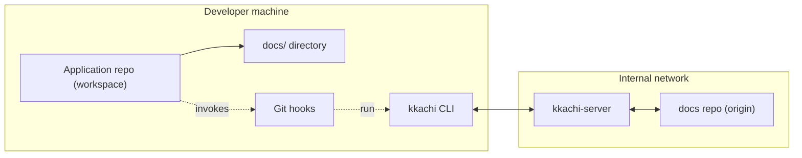

# Kkachi 🐦

Git 기반 프로젝트 여러 개가 하나의 문서 저장소를 공유할 때,  
Kkachi는 개발자가 `subtree`나 `submodule` 없이도 **문서 원본을 중앙에서 안전하게 관리**할 수 있게 해 주는 도구입니다.

하나의 중앙 docs repository를 기준으로, 각 애플리케이션 저장소의 `docs/` 디렉토리를 자동으로 동기화하고 상태를 보여 주는 **서버 + CLI** 조합입니다.

---

## 개요

Kkachi는 다음과 같은 환경을 대상으로 설계되었습니다.

- Git 사용은 익숙하지만,  
  `subtree`, `worktree`, 서브모듈과 같은 복잡한 Git 기능을 문서 관리에까지 적용하고 싶지 않은 팀
- 서버, 앱, 어드민 등 **여러 애플리케이션 저장소가 하나의 문서 세트**를 공유해야 하는 팀
- 문서의 **진짜 원본은 하나의 docs repo**에서 관리하고,  
  각 애플리케이션 저장소에는 `docs/` 디렉토리만 복사해서 두고 싶은 팀

Kkachi는 다음 두 컴포넌트로 구성됩니다.

- **kkachi-server**
  - 중앙에서 여러 프로젝트의 docs repo를 clone/관리하는 서버
  - REST API를 통해 docs HEAD, 스냅샷 조회 및 업데이트를 수행
- **kkachi CLI (`kkachi`)**
  - 각 개발자 로컬 workspace에서 실행하는 커맨드라인 도구
  - `kkachi init`, `kkachi status`, `kkachi fix`, `kkachi hook ...` 등을 제공
  - Git hooks와 연동되어 커밋/푸시 시점에 문서 상태를 자동으로 점검

---

## 아키텍처 개요 🗺️

아래는 Kkachi의 상위 구조를 간단히 표현한 다이어그램입니다.



- **Application repo**: 각 서비스/앱 코드 저장소 (예: `sudal`, `sudal_app`)
- **docs repo**: 문서 원본을 관리하는 전용 Git 저장소 (예: `sudal_docs`)
- **docs/ directory**: workspace 내부에서 실제로 수정하는 문서 디렉토리
- **Git hooks**: `pre-commit`, `post-checkout`, `post-merge`, `post-rewrite`, `pre-push`, `commit-msg`에서 `kkachi hook ...`을 호출

---

## 무엇이 편해지나요? 🎯

Kkachi를 도입하면 다음과 같은 점이 좋아집니다.

- **문서 원본이 하나로 정리**됩니다.
  - 코드 저장소마다 `docs/`가 흩어지지 않고,  
    최종 기준은 항상 중앙 docs repo의 `main` 브랜치입니다.
- **개발자 워크플로우는 기존 Git과 거의 동일**합니다.
  - `git clone`, `git pull`, `git commit`, `git push` 흐름을 유지하면서,
  - 문서 동기화와 상태 확인만 Kkachi가 자동으로 도와줍니다.
- **복잡한 Git 기능을 배우지 않아도 됩니다.**
  - 문서 공유를 위해 `subtree`나 `submodule`을 설정할 필요가 없습니다.
- **충돌은 사람이 해결하되, 발견과 흐름 관리는 도구가 담당**합니다.
  - Kkachi는 outdated 상황을 감지하고 3-way merge까지 수행하지만,
  - 실제 conflict marker를 제거하고 내용을 정리하는 작업은 개발자가 직접 수행합니다.

---

## 주요 개념 정리 📚

자세한 용어 정의는 `docs/requirement.md`에 있지만,  
이 문서에서는 이해에 필요한 핵심 개념만 요약합니다.

- **Project**
  - Kkachi가 관리하는 논리적인 프로젝트 이름입니다. (예: `sudal`, `dolgorae`)
- **Application repo**
  - 각 프로젝트의 애플리케이션 코드가 있는 Git 저장소입니다.
  - 여기에는 문서 원본이 아니라, 중앙 docs repo의 내용을 복사한 `docs/`만 둡니다.
- **Docs repo**
  - 프로젝트(또는 프로젝트 그룹)의 문서 원본을 저장하는 전용 Git 저장소입니다.
  - 문서의 이력과 HEAD는 항상 여기에서 관리됩니다.
- **Workspace**
  - Kkachi에 등록된 하나의 로컬 작업 디렉토리입니다.
  - 개발자가 실제로 코드와 문서를 수정하는 위치입니다.
- **kkachi-server**
  - docs repo를 로컬 clone으로 관리하고,  
    각 workspace의 요청에 따라 HEAD 조회, 스냅샷 제공, 업데이트를 수행합니다.
- **kkachi CLI**
  - `kkachi init`, `kkachi status`, `kkachi fix`, `kkachi hook ...` 명령을 제공하는 바이너리입니다.
  - `.kkachi.json`, `.kkachi_docs_hash`, `.kkachi_pending_fix` 파일을 통해 workspace 상태를 추적합니다.

이 개념들을 바탕으로, Kkachi는 “각 workspace의 `docs/`가 어느 docs repo commit을 기준으로 하고 있는지”를 추적하고,  
commit/push 시점에 이를 중앙 저장소와 비교하여 상태를 알려 줍니다.

---

## 빠른 시작 ⚡

### 1. 서버 준비

팀 차원에서 한 번만 kkachi-server를 배포합니다.

Docker를 사용한 로컬 개발 서버 실행 (hot reload 지원):

```bash
make server-run
```

Docker 없이 간단히 테스트하려면:

```bash
go run ./cmd/server
```

### 2. 워크스페이스 초기화 (`kkachi init`)

각 애플리케이션 저장소마다 **처음 한 번만** `kkachi init`을 실행합니다.

```bash
cd /path/to/your/app-repo

kkachi init \
  --server-url   https://kkachi.example.com \
  --project      sudal \
  --docs-repo-url git@github.com:your-org/sudal_docs.git
```

- `kkachi init`은 필요 시 인터랙티브하게 값들을 물어봅니다.
- 실행이 완료되면:
  - 서버에 workspace가 등록되고,
  - 중앙 docs repo의 현재 스냅샷이 `docs/` 디렉토리로 내려오며,
  - `.kkachi.json`, `.kkachi_docs_hash` 등이 생성됩니다.
  - Git hooks에 `kkachi hook ...` 호출이 자동으로 설치됩니다.

### 3. 일상적인 사용 흐름

초기화 이후에는 기존 Git 사용과 거의 동일합니다.

```bash
# 코드와 문서 수정
vim docs/guide.md

# 변경 사항 스테이징
git add docs/guide.md

# 커밋 (pre-commit hook에서 kkachi가 실행됨)
git commit -m "Update docs for new feature"

# 푸시 (pre-push hook에서 상태 확인)
git push origin main
```

- `pre-commit` 훅에서:
  - docs 변경 여부를 확인하고,
  - 필요 시 중앙 docs repo에 업데이트를 시도합니다.
- `pre-push` 훅에서:
  - 아직 해결되지 않은 conflict marker나 pending fix 상태가 있으면 푸시를 막고 경고합니다.

---

## 워크플로우 예시 🧪

아래는 “문서를 수정하고, outdated 상태를 처리한 뒤, 다시 동기화하는” 일반적인 흐름 예시입니다.

1. 현재 상태 확인

   ```bash
   kkachi status
   ```

   - 로컬 `docs/`가 어떤 docs repo commit을 기준으로 하는지
   - 서버의 최신 docs HEAD는 무엇인지
   - `up_to_date`, `outdated`, pending fix 여부 등을 보여 줍니다.

2. 문서 수정 및 커밋

   ```bash
   # docs/ 디렉토리에서 문서 수정
   vim docs/feature_x.md

   git add docs/feature_x.md
   git commit -m "Document feature X behavior"
   ```

3. pre-commit 단계에서 outdated 감지

   - 누군가가 먼저 중앙 docs repo를 갱신했다면,
   - `kkachi hook pre-commit`이 outdated 상황을 감지하고 3-way merge를 수행합니다.
   - 이때 충돌이 발생하면 conflict marker가 삽입된 상태로 커밋이 차단됩니다.

4. 충돌 해결 후 마무리 (`kkachi fix`)

   ```bash
   # conflict marker를 사람이 직접 정리
   vim docs/feature_x.md

   # 충돌을 모두 해결했다면
   kkachi fix
   ```

   - `kkachi fix`는 pending fix 상태를 정리하고,  
     이후 커밋/푸시가 정상적으로 진행될 수 있도록 workspace 상태를 업데이트합니다.

---

## 서버 배포 🚀

### 필수 요구사항

- **Go** 1.25+
- **Docker** (`make server-run` 사용 시)
- **Git** (PATH에 등록 필요)

### 환경 변수

| 변수 | 기본값 | 설명 |
|------|--------|------|
| `PORT` | `5789` | 서버 리슨 포트 |
| `STATE_FILE_PATH` | `data/kkachi_state.json` | 상태 저장 파일 경로 |
| `WEB_DIST_DIR` | `web/dist` | Web UI 빌드 디렉토리 (v2) |

### Makefile 타겟

| 타겟 | 설명 |
|------|------|
| `make server-run` | Docker + hot reload로 개발 서버 실행 |
| `make server-build` | 프로덕션 Docker 이미지 빌드 |
| `make server-test` | 전체 서버 테스트 실행 |
| `make cli-build` | kkachi CLI 바이너리 빌드 |
| `make cli-install` | CLI를 `$GOPATH/bin`에 설치 |

### 배포 체크리스트

배포 후 다음을 확인하세요:

```bash
# 헬스체크
curl http://localhost:5789/healthz
# 예상 응답: {"ok":true}

# Web UI(SPA) 확인
curl -i http://localhost:5789/
# 예상: 200과 HTML (web dist가 없으면 원인을 알려주는 에러 응답)

# Web API 별칭(v2) 확인
curl http://localhost:5789/api/state
# 예상: /state와 동일한 JSON

# API 상태 확인 (v1)
curl http://localhost:5789/state
```

---

## 더 알고 싶다면 📖

이 문서는 "Kkachi가 어떤 문제를 해결하고, 어떤 식으로 사용하는지"에 집중한 개요 문서입니다.  
구체적인 요구사항, 상세 동작, 에러 처리 정책, API 스펙 등은 `/docs` 디렉토리를 참고하세요.

- 전체 요구사항 및 용어 정의: `docs/requirement.md`

Kkachi의 내부 구조나 프로토콜을 더 깊이 이해하고 싶다면 위 문서들부터 읽는 것을 권장합니다.
