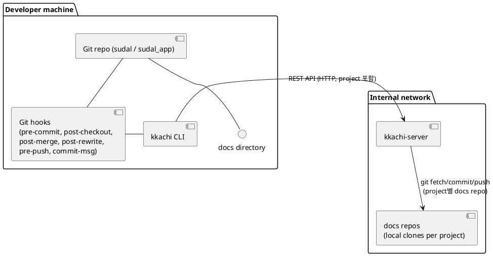

# Kkachi Requirement
## 1. 개요

### 1.1. 목적

까치(kkachi)는 여러 Git 작업 디렉토리에서 공유하는 하나 이상의 문서용 저장소(docs repo)를 안전하게 업데이트하고, 버전 불일치로 인한 충돌을 최소화하기 위한 **중앙 문서 조정 시스템**이다.

- sudal, sudal_app 등 여러 애플리케이션 repo는 문서를 **docs 디렉토리 내용만 copy**해서 사용한다.
- 문서의 실제 원본과 이력은 **하나 이상의 문서 전용 Git repo(예: sudal_docs)**가 관리한다.
- kkachi는
  - 하나 이상의 docs repo(예: `sudal_docs`, `dolgorae_docs`)에 대한 **실제 쓰기 권한을 가진 중앙 서버(kkachi-server)**와
  - 각 개발자 작업 디렉토리에서 동작하는 **CLI 클라이언트(kkachi)**,
  - 그리고 여러 **Git hook(pre-commit, post-checkout, post-merge, post-rewrite, pre-push, commit-msg)**으로 구성된다.

문서 수정 시에는 다음 원칙을 따른다.

- 연결된 docs repo(예: `sudal_docs`)와의 동기화와 충돌 감지는 최대한 자동화한다.
- 그러나 실제 **충돌 내용의 수정은 항상 사람이 직접** 수행한다.
- kkachi는 3-way merge와 conflict marker 삽입까지 담당하고, marker를 없애는 수정은 개발자가 한다.

### 1.2. 범위

이 문서는 다음을 포함한다.

- kkachi-server 기능 요구사항
- kkachi CLI 기능 요구사항
- Git hook 동작 방식
  - pre-commit
  - post-checkout
  - post-merge
  - post-rewrite
  - pre-push
  - commit-msg
- docs repo(sudal_docs 등)의 버전 관리 모델
- 대표 시나리오 및 에러 처리 요구사항

구체적인 Go 코드, 패키지 구조, 실제 Git 명령 사용 방식 등은 별도의 설계 문서에서 다룬다.

> 이 문서에서 `sudal`, `sudal_app`, `sudal_docs`는 **예시 project 그룹 이름**일 뿐이며, kkachi는 `sudal`, `dolgorae` 등 여러 project와 각각의 docs repo에 대해 동일한 방식으로 동작한다. project 단위 동작 규약은 특정 repo 이름이 아니라 “project” / “docs repo” 용어를 기준으로 정의한다.

---

## 2. 용어 정의

### 2.1. 공통 용어

| 용어 | 의미 |
|---|---|
| project | kkachi가 관리하는 논리적 프로젝트 이름. 예: `sudal`, `dolgorae` |
| application repo | 각 project의 코드 저장소. 예: `sudal` 서버 repo, `sudal_app` 클라이언트 repo |
| docs repo | 각 project 또는 project 그룹의 문서 원본을 저장하는 전용 Git repo. 예: `sudal_docs`, `dolgorae_docs` |
| workspace | kkachi에 등록된 하나의 작업 디렉토리. 예: `/Users/karl/dev/sudal` |
| docs 디렉토리 | 각 workspace 내에서 연결된 docs repo 내용을 copy해 두는 디렉토리. 기본값은 `docs` |
| kkachi-server | 하나 이상의 docs repo를 실제로 clone하고 관리하는 중앙 REST 서버 |
| kkachi CLI | 각 workspace 내에서 실행되는 kkachi 바이너리. init, hook, status, fix 등을 제공 |
| `.kkachi.json` | workspace별 kkachi 설정 파일 |
| `docs_hash_file` | 해당 workspace의 docs가 기반으로 하는 docs repo commit hash를 기록하는 파일 경로 설정 값. v1 기본값은 `.kkachi_docs_hash` |
| `.kkachi_pending_fix` | kkachi가 outdated merge를 수행한 뒤, 아직 사용자가 충돌을 모두 해결하고 fix를 완료하지 않은 상태임을 나타내는 플래그 파일 |
| base_docs_hash | 현재 workspace의 docs가 **어느 docs repo commit을 기준으로 수정되었는지**를 나타내는 hash. 일반적으로 `docs_hash_file`이 가리키는 값과 동일한 의미를 갖는다. |
| docs_snapshot | 현재 workspace의 docs 디렉토리 내용을 tar.gz 등으로 패키징한 바이너리 데이터 |
| HEAD | 각 docs repo(main 브랜치)의 최신 commit hash |
| kkachi status | 현재 workspace의 docs 기준 버전과 연결된 docs repo HEAD의 관계를 요약해서 보여주는 kkachi 서브커맨드 |

### 2.2. 예시 용어 (sudal 기반)

| 용어 | 의미 (예제) |
|---|---|
| sudal | 예시 project A의 서버 애플리케이션 Git repo |
| sudal_app | 예시 project A의 클라이언트 애플리케이션 Git repo |
| sudal_docs | 예시 project A에 대한 docs repo (docs repo의 한 예시) |

---

## 3. 전체 구조

### 3.1. 컴포넌트 구성

kkachi-server와 kkachi CLI는 하나의 Git repository에서 함께 개발 및 관리된다.

- kkachi-server
  - 사내 내부 서버에서 동작
  - 하나 이상의 docs repo(예: `sudal_docs`, `dolgorae_docs`)를 로컬에 clone해서 관리
  - 각 workspace의 상태를 JSON 등으로 저장
  - REST API를 통해
    - project별 docs repo HEAD 조회
    - 특정 commit 기준 docs snapshot 제공
    - docs snapshot을 반영해 새로운 docs repo commit 생성
- kkachi CLI
  - Go로 작성된 단일 바이너리 `kkachi`
  - 대표적인 서브커맨드 예시 (전체 목록은 6장 참조)
    - `kkachi init`
    - `kkachi status`
    - `kkachi fix`
    - `kkachi project add/delete`
    - `kkachi workspace register/unregister`
    - `kkachi state`
    - `kkachi hook pre-commit`
    - `kkachi hook post-checkout`
    - `kkachi hook post-merge`
    - `kkachi hook post-rewrite`
    - `kkachi hook pre-push`
    - `kkachi hook commit-msg`
  - `.kkachi.json`, `docs_hash_file`(기본: `.kkachi_docs_hash`), `.kkachi_pending_fix` 관리
  - 여러 Git hook에서 호출되어 각 project의 docs repo와의 동기화와 상태 체크를 수행
- Git hooks
  - `.git/hooks/pre-commit`에서 `kkachi hook pre-commit` 실행
  - `.git/hooks/post-checkout`에서 `kkachi hook post-checkout` 실행
  - `.git/hooks/post-merge`에서 `kkachi hook post-merge` 실행
  - `.git/hooks/post-rewrite`에서 `kkachi hook post-rewrite` 실행
  - `.git/hooks/pre-push`에서 `kkachi hook pre-push` 실행
  - `.git/hooks/commit-msg`에서 `kkachi hook commit-msg` 실행

### 3.2. 상위 구조 다이어그램 (PlantUML)



### 3.3. Git hook 역할 개요

| Hook 이름 | 호출 시점 | kkachi 역할 요약 |
|---|---|---|
| pre-commit | 커밋 직전 | docs 변경 감지, conflict 마커 검사, 연결된 docs repo 동기화 시도, outdated 시 3-way merge 및 커밋 차단 |
| post-checkout | 브랜치 또는 커밋 checkout 직후 | `kkachi status`를 통해 현재 docs 기준 버전과 연결된 docs repo HEAD의 관계를 표시. 자동 merge 없음 |
| post-merge | `git merge` 또는 merge 기반 `git pull` 이후 | `kkachi status` 호출. merge 결과에 대한 docs 상태를 안내. 자동 merge 없음 |
| post-rewrite | `git rebase`, `git commit --amend` 등 rewrite 이후 | 특히 `git fetch && git rebase` 후에 `kkachi status` 호출. 자동 merge 없음 |
| pre-push | 원격으로 push 직전 | docs에 conflict 마커나 `.kkachi_pending_fix`가 있으면 push 차단. 자동 fix 없음 |
| commit-msg | 커밋 메시지 확정 직전 | docs가 변경된 커밋이면, 최종 docs 기준 hash(예: `.kkachi_docs_hash`)로부터 `docs-version: <hash>` 라인을 메시지에 추가 |

---

## 4. 공통 버전 관리 모델

### 4.1. docs repo 기준 버전 관리

- kkachi-server는 하나 이상의 docs repo를 중앙 문서 저장소로 관리하며, 각 repo를 로컬 clone으로 유지한다.
- 각 docs repo(main 브랜치)의 HEAD commit hash를 **해당 repo의 기준 버전**으로 사용한다.
- 각 workspace는 자신이 연결된 docs repo에 대해, `docs_hash_file`(기본: `.kkachi_docs_hash`)로 현재 기준 commit을 기록한다.
  - 실제 파일명은 `.kkachi.json` 의 `docs_hash_file` 설정값을 따른다. v1 의 기본값은 `.kkachi_docs_hash` 이며, 구현 시에는 항상 설정 값을 사용해야 한다.

### `docs_hash_file` (`.kkachi_docs_hash`) 의미

`docs_hash_file`이 가리키는 값은 항상 다음 의미를 가진다(기본 파일 이름: `.kkachi_docs_hash`).

> "현재 workspace의 docs 디렉토리는 연결된 docs repo의 commit X를 기반으로 하고 있으며,
> 아직 push하지 않은 변경이 있다 하더라도, **마지막으로 kkachi를 통해 원격과 동기화한 기준 commit은 X**이다."

- init 직후 `docs_hash_file = 연결된 docs repo HEAD`
- pre-commit에서 `/docs/push`가 성공하면 `docs_hash_file = 새 HEAD`
- pre-commit에서 outdated를 감지하고 3-way merge를 수행한 후에는 `docs_hash_file = merge 기준이 된 remote HEAD`로 갱신한다. 이때 실제 충돌 내용은 사람이 수정한다.

---

## 5. kkachi-server 요구사항

(기본 구조는 기존 문서와 동일하며, CLI와 hook 동작에 맞는 부분만 강조한다.)

### 5.1. 서버 역할 요약

1. docs repo 로컬 관리

   - 최초 실행 시 설정된 각 docs repo(예: `sudal_docs`, `dolgorae_docs`)를 clone 한 뒤, `git fetch`로 한 번 동기화한다.
   - 이후에는 `/docs/push` 처리 시점에만 필요한 docs repo에 대해 `git fetch` / `reset --hard origin/main` 을 수행해 최신 HEAD 를 맞춘다.
2. docs 업데이트 요청 처리

   - workspace 로컬 docs snapshot을 받아
   - base_docs_hash와 해당 project에 매핑된 docs repo HEAD를 비교
   - 조건이 맞으면 해당 docs repo에 새로운 commit 생성 및 push
3. outdated 감지

   - base_docs_hash와 docs repo HEAD가 다르면
   - 바로 push하지 않고 `status = outdated` 응답
4. docs snapshot 제공

   - 특정 commit 기준 혹은 HEAD 기준으로
   - docs 디렉토리 내용을 tar.gz 등으로 반환
5. workspace 상태 관리

   - workspace별 마지막 docs_hash, 메타데이터를 JSON 등으로 저장

### 5.2. 서버 내부 상태 모델

서버는 내부적으로 다음과 같은 구조를 가진 state를 유지한다. v1에서는 이 state 를 **단일 JSON 파일** 로 저장한다. (향후 필요 시 embedded DB 등으로 확장 가능)

```json
{
  "docs_repos": {
    "sudal_docs": {
      "id": "sudal_docs",
      "path": "/var/lib/kkachi/sudal_docs",
      "current_head": "abcd1234"
    }
  },
  "project_to_docs_repo": {
    "sudal": "sudal_docs"
  },
  "workspaces": {
    "sudal:/Users/karl/dev/sudal": {
      "workspace_id": "sudal:/Users/karl/dev/sudal",
      "project": "sudal",
      "docs_repo_id": "sudal_docs",
      "local_path": "/Users/karl/dev/sudal",
      "repo_url": "git@github.com:SeventeenthEarth/sudal.git",
      "docs_hash": "abcd1234",
      "last_reported_at": "2025-11-29T10:00:00Z",
      "owner_email": "karl@example.com",
      "last_actor_email": "karl@example.com"
    },
    "sudal:/Users/karl/dev/sudal_app": {
      "workspace_id": "sudal:/Users/karl/dev/sudal_app",
      "project": "sudal",
      "docs_repo_id": "sudal_docs",
      "local_path": "/Users/karl/dev/sudal_app",
      "repo_url": "git@github.com:SeventeenthEarth/sudal_app.git",
      "docs_hash": "abcd1234",
      "last_reported_at": "2025-11-29T10:05:00Z",
      "owner_email": "someone@example.com",
      "last_actor_email": "someone@example.com"
    }
  }
}
```

- `docs_repos`는 kkachi-server가 관리하는 모든 docs repo 목록이다. 각 엔트리는 로컬 clone 경로와 현재 HEAD를 포함한다.
- `project_to_docs_repo`는 project 이름을 docs repo ID로 매핑한다.  
  v1 기준으로 **각 project는 정확히 1개의 docs repo에 매핑되며, 하나의 docs repo를 여러 project가 공유하지 않는다.**
- 각 workspace 엔트리는 id, 프로젝트명, 연결된 `docs_repo_id`, path, 마지막 docs_hash, 마지막 통신 시각, 해당 workspace 를 최초로 등록한 사용자의 email(예: `owner_email`), 그리고 마지막으로 docs 를 변경한 actor 의 email(예: `last_actor_email`) 등을 갖는다.
- 새 workspace가 등록되면 서버는 해당 시점의 project별 docs repo HEAD를 조회해 workspace의 `docs_hash` 초기값으로 저장하고, 동일한 값을 `current_docs_head`로 응답한다. 이 때 `owner_email` 은 **해당 workspace_id 에 대해 최초로 등록 요청을 보낸 actor 의 email** 로 한 번만 설정하고, 이후 동일한 workspace_id 로 재등록이 들어와도 변경하지 않는다. 반면 `last_actor_email` 은 `/docs/push` 등 쓰기 요청이 성공할 때마다 해당 요청의 actor_email 로 갱신한다.
  `kkachi init` 은 이 HEAD 기준 snapshot 을 받아 로컬 `docs/` 디렉토리를 생성하며, 로컬 `docs_hash_file`(기본: `.kkachi_docs_hash`)도 이 값으로 초기화한다.
- 이후 `/docs/push` 호출 시에는 결과 status 와 관계없이( `updated` / `nochange` / `outdated` ) 서버가 요청을 처리한 시점의 docs repo HEAD 를 이용해 해당 workspace 의 `docs_hash` 를 갱신한다.
  - 특히 `status = "outdated"` 인 경우에도 서버는 응답의 `current_docs_hash`(서버 기준 최신 HEAD)를 workspace `docs_hash` 로 업데이트해, 서버 state 와 로컬 `docs_hash_file`(기본: `.kkachi_docs_hash`)이 같은 기준 hash 를 바라보도록 맞춘다.
  이렇게 하면 `kkachi init` 이후에는 항상 "서버 docs HEAD = 로컬 docs" 상태에서 시작하게 되며,  
  init 시점에 로컬 docs 가 서버 HEAD 와 이미 동일하다는 별도 전제를 두지 않아도 된다.

> 참고: `/state` 응답은 위 내부 state 전체를 그대로 노출하지 않고,  
> **project 별 docs HEAD** 와 각 workspace 의 요약 정보만 제공한다.
> v1 기준으로 `/state` 는 다음과 같은 형태를 가진다.
>
> ```json
> {
>   "docs_heads": {
>     "sudal": "abcd1234",
>     "dolgora": "ef567890"
>   },
>   "workspaces": [
>     {
>       "workspace_id": "sudal:/Users/karl/dev/sudal",
>       "project": "sudal",
>       "docs_repo_id": "sudal_docs",
>       "local_path": "/Users/karl/dev/sudal",
>       "repo_url": "git@github.com:SeventeenthEarth/sudal.git",
>       "docs_hash": "abcd1234",
>       "last_reported_at": "2025-11-29T10:00:00Z",
>       "last_actor_email": "karl@example.com"
>     },
>     ...
>   ]
> }
> ```
>
> - `docs_heads`는 `project` → docs repo HEAD commit hash 를 나타낸다.
> - workspace 요약에는 `workspace_id`, `project`, `docs_repo_id`, `local_path`, `repo_url`, `docs_hash`, `last_reported_at` 정도가 포함되며,
> - `docs_repos` 및 `project_to_docs_repo` 전체는 내부 운영 도구에서만 사용한다.

> workspace_id 규약: v1 기준으로 kkachi 는 각 workspace 를 `<project>:<workspace-root-absolute-path>` 형식의 문자열로 식별한다. 예를 들어 project 가 `sudal`, workspace root 가 `/Users/karl/dev/sudal` 인 경우 `workspace_id = "sudal:/Users/karl/dev/sudal"` 이다. `/workspaces/register` 는 동일한 workspace_id 로 여러 번 호출될 수 있으며, 이 경우 새로 등록이 아니라 기존 workspace 의 메타데이터(local_path, repo_url 등)를 갱신하는 의미로 동작한다. `DELETE /workspaces/{workspace_id}` 로 등록을 해제한 뒤 동일 디렉토리에서 다시 `kkachi init` 을 실행하면, 같은 규칙에 따라 동일한 workspace_id 가 재사용된다.

### 5.3. REST API 목록

| 메서드 | 경로 | 설명 |
|---|---|---|
| POST | `/workspaces/register` | 새로운 workspace 등록 또는 기존 workspace 정보 갱신 (등록되지 않은 project 인 경우 400 Bad Request) |
| GET | `/docs/head` | 지정된 project에 매핑된 docs repo(main)의 현재 HEAD commit hash 조회 (`project` query 필수) |
| GET | `/docs/snapshot` | 지정된 project/docs repo에 대해 특정 commit(또는 HEAD) 기준 docs snapshot 반환 (`project` query, `commit` optional) |
| POST | `/docs/push` | workspace에서 보낸 docs snapshot을 기반으로 docs repo 업데이트 시도 (project는 workspace_id를 통해 결정) |
| GET | `/state` | 디버그용 전체 상태 확인 (개발, 내부용) |
| DELETE | `/projects/{project}` | 지정된 project의 docs repo 설정과 로컬 clone 디렉토리를 제거 |
| DELETE | `/workspaces/{workspace_id}` | 특정 workspace 등록 정보를 제거 (로컬 디스크는 삭제하지 않음) |
| POST | `/projects` | project → docs repo 매핑 추가 또는 갱신 |

> 이 문서의 나머지 부분에서 `/docs/head`와 `/docs/snapshot` 호출에 대한 설명은 모두 `?project=<project>` query param을 포함하는 것으로 본다.

### 5.4. 프로젝트 제거/클린업

- 목적
  - 더 이상 사용하지 않는 project를 kkachi-server에서 제거하고, 대응되는 로컬 docs repo clone 디렉토리를 정리한다.
- 엔드포인트
  - `DELETE /projects/{project}`
    - optional: `force=true` 쿼리 파라미터로 등록된 workspace가 남아 있어도 강제 제거할 수 있게 선택적으로 허용한다.
- 동작 요구사항
  - project가 존재하지 않으면 **404 Not Found + `{"error": "unknown_project"}`** 를 반환한다. (자세한 규약은 §5.8 참조)
  - 기본 동작은 해당 project에 연결된 workspace가 서버 state에 남아 있으면 **HTTP 409 Conflict + `{"error": "project_has_workspaces"}`** 로 거부하고, `force=true`일 때만 강제 삭제를 허용한다.
  - 삭제 성공 시:
    - `project_to_docs_repo` 매핑에서 project를 제거
    - 해당 docs repo clone 디렉토리가 더 이상 어떤 project에서도 사용되지 않는다면 로컬 디렉토리를 삭제
    - 상태 저장소의 해당 project/workspace 관련 엔트리를 함께 제거 또는 무효화
- 주의사항
  - 삭제된 project와 연결된 workspace는 이후 API 호출 시 실패하게 되므로, CLI 측에도 적절한 안내가 필요하다(예: "서버에 등록되지 않은 project입니다. 'kkachi init' 또는 'kkachi project add'를 다시 실행해 주세요." 등의 메시지 출력 후 exit code 1).
  - 로컬 clone 삭제 시 안전한 경로 검증을 수행해 다른 디렉토리를 오삭제하지 않도록 한다.

### 5.5. 프로젝트 추가/갱신

- 목적
  - runtime에 새로운 project를 등록하거나 기존 project의 docs repo 매핑을 갱신한다.
- 엔드포인트
  - `POST /projects`
- 동작 요구사항
  - 요청 바디에 project 이름, docs_repo_id, docs_repo_url 등을 포함한다.
    - v1에서는 `docs_repo_id` 를 **항상 docs repo Git URL 의 repo 이름 그대로** 사용한다.  
      예: `git@github.com:SeventeenthEarth/sudal_docs.git` → `"sudal_docs"`.
    - docs_repo_url 은 docs repo clone 에 사용되는 Git URL 자체이다.
    - kkachi CLI (`kkachi init`, `kkachi project add`) 는 **사용자로부터 docs_repo_url 만 입력받고**, 그 URL 로부터 repo 이름을 추출해 `docs_repo_id` 로 사용한다.  
      사용자가 임의의 `docs_repo_id` 를 직접 지정하거나 override 하는 기능은 v1에서는 제공하지 않는다.
      (코드 repo 의 `origin` remote 에서는 docs_repo 정보를 유추하지 않는다.)
  - 동일 project가 이미 존재하면 갱신 여부를 명시 flag로 요구하거나 idempotent 규칙을 정의한다.
  - 새 docs repo가 필요하면 clone을 트리거하고, 기존이면 fetch로 최신화한다.
  - 성공 시 상태 저장소와 Docs Repo Manager 구성을 업데이트한다.
- 주의사항
  - 운영 관점에서는 별도의 관리자/역할 구분 없이, kkachi 를 사용할 수 있는 누구나 project 를 추가·갱신할 수 있다.
    - v1 에서는 별도의 인증/인가는 없으므로, `kkachi init` 이 최초 init 시점에 자동으로 `/projects` 를 호출해도 무방하다.
    - kkachi 는 별도의 인증/권한 체계가 없는 단순 사내 시스템이므로, 모든 사용자가 `/projects` 를 호출해 project 를 생성·갱신할 수 있다고 가정한다.
  - project ↔ docs_repo 매핑 변경 시 기존 workspace들이 영향을 받을 수 있으므로, CLI/UX에서 안내가 필요하다.
  - `force=true` 옵션은 **위험도가 높은 동작**이므로, v1 기준 기본 kkachi CLI (`kkachi project delete`) 에서는 별도의 `--force` 플래그를 제공하지 않는다.
    - 필요한 경우 사용자는 직접 API 호출(curl 등) 이나 별도 관리 도구를 통해 `force=true` 를 사용해 project 를 제거할 수 있으며,
    CLI 측에서는 workspace 가 남아 있어 409 가 발생하는 경우 "등록된 workspace 가 남아 있어 project 를 삭제할 수 없습니다. 먼저 해당 workspace 들을 정리한 뒤 다시 시도해 주세요." 와 같은 안내를 출력하고 exit code 1 로 처리하는 것을 기본 규칙으로 한다.

### 5.6. Workspace 제거 (디렉토리 등록 해제)

- 목적
  - 특정 로컬 workspace 디렉토리를 kkachi-server 관리 대상에서만 제거한다. 실제 로컬 디스크의 디렉토리는 삭제하지 않는다.
- 엔드포인트
  - `DELETE /workspaces/{workspace_id}`
- 동작 요구사항
  - 존재하지 않는 workspace_id면 404 반환
  - 삭제 성공 시:
    - state 저장소에서 해당 workspace 엔트리를 제거
    - project 메타데이터(등록된 workspace 수 등) 업데이트
  - force 옵션은 기본 불필요하며, 단순 삭제만 수행한다.
- 주의사항
  - CLI에서 사용 시 사용자에게 정말 제거할 것인지 확인 프롬프트를 제공해야 한다.
  - 로컬 디렉토리는 그대로 남으므로, 사용자가 필요 시 수동 정리한다.
  - 삭제된 `workspace_id`를 그대로 가진 `.kkachi.json`으로 `kkachi status`, `kkachi fix` 등 workspace 기반 명령을 실행하면 서버에서 404/400이 발생할 수 있으며, 이 경우 CLI는 "서버에 등록되지 않은 workspace입니다. 'kkachi init'을 다시 실행해 주세요." 와 같은 메시지를 출력하고 exit code 1로 종료하는 것을 기본 규칙으로 한다.
  - 반대로 서버에는 `workspace_id`가 등록되어 있지만, 해당 로컬 디렉토리에서 아직 `kkachi init`을 실행하지 않아 `.kkachi.json`이 없는 경우도 있을 수 있다. 이 경우 해당 디렉토리에서 `kkachi status` 등을 실행하면 "현재 디렉토리가 kkachi workspace 가 아닙니다." 와 같은 메시지와 함께 exit code 1로 종료하며, 사용자가 필요 시 `kkachi init`을 통해 로컬 workspace 를 생성하는 것을 권장한다.

### 5.7. 다중 project / docs repo 운영 가이드

- 하나의 kkachi-server 인스턴스는 여러 project를 관리할 수 있다.  
  v1 기준 규약:
  - **각 project는 정확히 1개의 docs repo에 매핑**된다.
  - 하나의 docs repo를 여러 project가 공유하는 구성은 v1에서는 지원하지 않는다.
  - 이 관계는 `project_to_docs_repo` 매핑으로 표현하며, server/CLI 는 항상 **project 이름을 명시적으로** 전달해야 한다.
- kkachi CLI 는 코드 repo 이름이나 Git remote 이름에서 project 를 추론하지 않는다. `kkachi init` 과 관리용 커맨드에서는 항상 `--project` 인자를 통해 project 이름을 명시해야 하며, 기본값은 없다.
- 하나의 코드 repo clone 디렉토리는 기본적으로 하나의 workspace 로 취급한다.  
  하나의 project 아래에 서버/클라이언트/middleware 등 여러 코드 repo가 있을 수 있으며,
  이 경우 **여러 workspace가 동일한 `project` 와 `docs_repo_id` 를 공유**하게 된다.
  - 예: `project = "sudal"`, docs repo = `sudal_docs` 인 상태에서
    - `/Users/karl/dev/sudal` (server repo)
    - `/Users/karl/dev/sudal_app` (client repo)
    두 디렉토리는 서로 다른 workspace 이지만, 같은 project(`sudal`)와 docs repo(`sudal_docs`)에 연결될 수 있다.
- `/state` 와 `kkachi state --all` 은 항상 **project 단위**로 상태를 보여준다.  
  큰 조직에서는 필요에 따라 project 집합별로 kkachi-server 인스턴스를 나누어 운영할 수 있지만,  
  이는 인프라/운영 전략의 문제이며 요구사항 수준에서는 하나의 서버가 여러 project를 지원하는 모델을 기본으로 한다.

나머지 각 API의 상세 동작은 기존 요구사항과 동일하며, 여기에 kkachi CLI의 새로운 subcommand들과 잘 연동되도록 한다.
(`/docs/push`의 outdated 처리, `/docs/snapshot`의 commit 파라미터 처리 등은 그대로 유지)

### 5.8. 에러 코드 및 unknown project/workspace 응답 규약

- 목적  
  - server 와 CLI 구현자가 endpoint 별 HTTP status 와 `"error"` 코드 값을 일관되게 사용할 수 있도록 기준을 정의한다.

- 기본 규칙
  - `/docs/head`, `/docs/snapshot`
    - 등록되지 않은 `project` 인 경우: **HTTP 400 Bad Request** + `{"error": "unknown_project"}` JSON
  - `POST /workspaces/register`
    - 등록되지 않은 `project` 인 경우: **HTTP 400 Bad Request** + `{"error": "unknown_project"}` JSON
  - `POST /docs/push`
    - 등록되지 않은 `workspace_id` 인 경우: **HTTP 400 Bad Request** + `{"error": "unknown_workspace"}` JSON
  - `DELETE /workspaces/{workspace_id}`
    - 없는 workspace 인 경우: **HTTP 404 Not Found** + `{"error": "unknown_workspace"}` JSON
  - `DELETE /projects/{project}`
    - 없는 project 인 경우: **HTTP 404 Not Found** + `{"error": "unknown_project"}` JSON
    - 해당 project 에 연결된 workspace 가 남아 있어 삭제할 수 없는 경우: **HTTP 409 Conflict** + `{"error": "project_has_workspaces"}` JSON
  - docs repo 에 존재하지 않는 commit 을 가리키는 경우(예: force-push, 오래된 commit GC 등): **HTTP 400 Bad Request** + `{"error": "unknown_docs_commit"}` JSON
  - 그 외 검증 실패(요청 포맷 오류 등): **HTTP 400**
- CLI 는 HTTP 4xx/5xx 여부와 상관없이 `"error": "unknown_project"`, `"unknown_workspace"`, `"unknown_docs_commit"` 코드 값을 감지하면
  “서버에 등록되지 않은 project/workspace” 또는 “알 수 없는 docs commit” 이라는 사용자 친화적 설명과 함께 exit code 1 로 처리한다.

> 참고: 아래 표는 v1 기준 에러 코드와 HTTP status 매핑을 한눈에 보기 위한 요약이다.  
> 표에 없는 일반적인 검증 실패(필수 필드 누락, JSON 파싱 오류 등)는 모두 **HTTP 400 Bad Request** 이며, 별도의 고정 `"error"` 코드는 정의하지 않는다.

| Endpoint (Method)                   | 상황(Condition)                                                   | HTTP Status       | 에러 JSON / 코드                                  |
| ----------------------------------- | ----------------------------------------------------------------- | ----------------- | ------------------------------------------------- |
| `GET /docs/head`                    | `project` 가 서버에 등록되지 않은 경우                           | `400 Bad Request` | `{"error": "unknown_project"}`                    |
| `GET /docs/snapshot`                | `project` 가 서버에 등록되지 않은 경우                           | `400 Bad Request` | `{"error": "unknown_project"}`                    |
| `GET /docs/snapshot`                | `commit` 이 docs repo 에 존재하지 않는 commit 인 경우            | `400 Bad Request` | `{"error": "unknown_docs_commit"}`                |
| `POST /workspaces/register`         | `project` 가 서버에 등록되지 않은 경우                           | `400 Bad Request` | `{"error": "unknown_project"}`                    |
| `POST /docs/push`                   | `workspace_id` 가 서버 state 에 존재하지 않는 경우              | `400 Bad Request` | `{"error": "unknown_workspace"}`                  |
| `POST /docs/push`                   | 동일 docs repo 에 대한 다른 `/docs/push` 가 진행 중인 경우      | `409 Conflict`    | `{"ok": false, "error": "docs_repo_busy"}`        |
| `POST /docs/push`                   | `base_docs_hash` 가 docs repo 에 존재하지 않는 commit 인 경우    | `400 Bad Request` | `{"error": "unknown_docs_commit"}`                |
| `DELETE /workspaces/{workspace_id}` | 해당 `workspace_id` 가 존재하지 않는 경우                        | `404 Not Found`   | `{"error": "unknown_workspace"}`                  |
| `DELETE /projects/{project}`        | 해당 `project` 가 존재하지 않는 경우                             | `404 Not Found`   | `{"error": "unknown_project"}`                    |
| `DELETE /projects/{project}`        | project 에 아직 등록된 workspace 가 남아 있어 삭제할 수 없는 경우 | `409 Conflict`    | `{"error": "project_has_workspaces"}`             |

### 5.9. 동시성 제어 요구사항

* sudal_docs 등 docs repo 에 대한 모든 쓰기 경로(즉, `/docs/push` 를 통해 docs repo 에 새 commit 을 만드는 모든 흐름)는 **docs_repo_id 단위 mutex** 로 보호한다.

  * v1 모델에서는 하나의 kkachi-server 가 여러 project 를 지원할 수 있고, 각 project 는 자신의 docs repo 에 1:1 로 매핑된다.
  * 각 `docs_repo_id` 마다 별도의 mutex 를 두고 해당 repo 에 대한 `/docs/push` 호출만 보호하면,
    - 프로젝트 간에는 서로 영향을 주지 않고,
    - project:docs repo = 1:1 이므로 project 단위 쓰기도 자연스럽게 직렬화된다.
* `/docs/push` usecase 는 **usecase 레이어에서 제공하는 `DocsRepoMutexManager`** 를 사용해 `docs_repo_id` 별 mutex 를 관리한다.
  * HTTP handler 는 `project` 를 받아 usecase 를 호출하는 역할만 하고, mutex 제어는 하지 않는다.
  * usecase 는 `project → docs_repo_id` 를 해석한 뒤, 해당 `docs_repo_id` 에 대해 **짧은 시간 동안만 TryLock** 을 시도한다.
    - 일정 시간(예: 1~2초) 내에 lock 을 획득하지 못하면, `/docs/push` 는 **동일 docs repo 에 대한 다른 push 가 진행 중인 것으로 간주**하고
      HTTP 409 등과 함께 `"docs_repo_busy"` 와 같은 에러 코드를 반환한다.
    - CLI 는 이 에러를 감지하면 사용자가 나중에 다시 시도해야 함을 안내하고,
      특히 **pre-commit** 의 경우에는 `/docs/push` 호출을 **최대 3회(초기 1회 + 추가 2회)까지, 각 시도 사이 300ms 간격으로 재시도**한 뒤에도 busy 인 경우
      "다른 workspace 가 현재 docs 를 업데이트 중입니다. 잠시 후 다시 시도해 주세요." 와 같은 메시지를 출력하고 commit 을 차단(exit code 1)한다.
* mutex 구간 안에서 다음이 보장된다.

  * `git fetch` / `reset --hard origin/main` / base 비교 / snapshot 적용 / diff 검사 / commit / push 가 하나의 atomic 시퀀스로 수행된다.
  * 같은 docs repo 에 대한 다른 `/docs/push` 가 HEAD 를 변경할 수 없으므로, outdated 판별과 commit 생성이 race 없이 동작한다.
* `/docs/snapshot`, `/docs/head`, `/state`, `/workspaces/*` 등 읽기 전용 또는 메타데이터 위주 API 는 별도 mutex 없이 동시에 처리 가능하다. 필요 시 단순화를 위해 read/write lock 을 도입해도 된다.

---

## 6. kkachi CLI 요구사항

kkachi CLI는 Go로 작성된 단일 바이너리이며, 다음 서브커맨드를 제공한다.

- `kkachi init`
- `kkachi status`
- `kkachi fix`
- `kkachi project add`
- `kkachi project delete`
- `kkachi workspace register`
- `kkachi workspace unregister`
  - `kkachi state` (옵션: `--all`)
  - `kkachi hook pre-commit`
- `kkachi hook post-checkout`
- `kkachi hook post-merge`
- `kkachi hook post-rewrite`
  - `kkachi hook pre-push`
  - `kkachi hook commit-msg`
- `kkachi pull`

> 플랫폼 전제: v1 기준으로 kkachi 는 POSIX 계열 경로(macOS, Linux 등)를 1차 대상으로 설계한다. `workspace_id = "<project>:<workspace-root-absolute-path>"` 규약 예시에서 사용되는 `/Users/...` 형태는 POSIX 경로를 가정한 것이며, Windows 드라이브 문자/백슬래시 등의 세부 규약은 v1 요구사항 범위를 벗어난다. 필요 시 Windows 지원에 맞춰 별도 workspace_id 포맷을 정의할 수 있다.

이 문서에서 CLI 서브커맨드는 크게 두 그룹으로 나눈다.

- **workspace 로컬 명령**: 현재 디렉토리의 `.kkachi.json` / Git repo 상태에 종속된다.
  - `kkachi init`, `kkachi status`, `kkachi fix`, `kkachi state`(기본 모드), 모든 `kkachi hook ...` 명령
- **전역(디렉토리 비종속) 관리 명령**: 특정 workspace 루트에 서 있지 않아도 실행 가능하다.
  - `kkachi project add/delete`, `kkachi workspace register/unregister`, `kkachi state --all`

또한 서버에 영향을 주는 모든 쓰기/관리 명령(`kkachi init`, `kkachi project add`, `kkachi workspace register`, `/docs/push`를 트리거하는 hook 등)은
**actor 식별자**로서 Git 사용자 email (`git config user.email`) 을 함께 사용한다.
CLI 는 가능하면 이 값을 자동으로 읽어 사용하며, 없는 경우에는 사용자 프롬프트를 통해 입력받는다.

### 6.1. 공통 로컬 파일

#### 6.1.1. `.kkachi.json`

각 workspace 루트 디렉토리에 생성한다.

예시:

```json
{
  "server_url": "http://kkachi.internal:5789",
  "workspace_id": "sudal:/Users/karl/dev/sudal",
  "project": "sudal",
  "actor_email": "karl@example.com",
  "docs_dir": "docs",
  "docs_hash_file": ".kkachi_docs_hash"
}
```

필수 필드:

- `server_url`
- `workspace_id`
- `project`
- `actor_email`
- `docs_dir`
- `docs_hash_file`

> 주의: `docs_dir` 는 **로컬 workspace 안에서** docs 를 보관하는 디렉토리 경로이며, 서버와 주고받는 snapshot tar 내부의 루트 디렉토리 이름은 항상 `docs/` 로 고정한다.
> 즉, 로컬에서 `docs_dir = "docs_kr"` 와 같이 다른 이름을 사용하더라도, snapshot 생성 시에는 해당 디렉토리 내용을 tar 내부 `docs/` 로 매핑하고, 서버는 각 project 에 매핑된 docs repo 의 `docs/` 디렉토리에만 내용을 반영한다.
> 아래에서 예시로 사용하는 `git diff --quiet -- docs` 와 같은 명령의 `docs` 부분은 기본값을 가리키는 것이며, 실제 구현에서는 항상 `.kkachi.json` 의 `docs_dir` 설정값을 사용해야 한다.

#### 6.1.2. `.kkachi_docs_hash`

- 내용: 단일 줄의 commit hash

예:

```text
abcd1234
```

- init 시 연결된 docs repo HEAD로 설정
- `kkachi hook pre-commit`, `kkachi fix`에서 업데이트
- 이 값은 해당 workspace에서 docs를 편집할 때 기준이 되는 docs repo commit을 의미한다.

#### 6.1.3. `.kkachi_pending_fix`

- kkachi가 pre-commit에서 **outdated 상태를 감지하고 3-way merge를 수행한 경우** 생성되는 플래그 파일이다. v1 기준 이 파일명은 **항상 `.kkachi_pending_fix`로 고정**하며, `.kkachi.json` 에서 별도로 커스터마이즈하지 않는다.
- 존재 의미:
  - 이 workspace의 docs에는 kkachi가 삽입한 conflict marker를 기준으로 사람이 수정해야 하는 잔여 작업이 있을 수 있으며,
  - 아직 `kkachi fix`가 성공적으로 완료되지 않았다.
- 필수 요구사항:
  - pre-commit에서 outdated merge가 발생하면 `.kkachi_pending_fix`를 반드시 생성한다.
  - `kkachi fix`가 성공적으로 연결된 docs repo에 새 commit을 만들고 `.kkachi_docs_hash`를 갱신하면 `.kkachi_pending_fix`를 삭제한다.
  - pre-commit이 outdated가 아닌 정상 흐름(exit code 0)으로 종료하더라도, `.kkachi_pending_fix` 의 생성/삭제 책임은 원칙적으로 `kkachi fix` 에 있다. pre-commit 은 pending fix 상태를 감지하면 commit 을 차단하고 사용자가 먼저 `kkachi fix` 를 실행하도록 안내만 해야 한다.
- 파일 내용:
  - 단순 플래그 파일로 취급하며, 최소한 다음 정보 포함을 권장한다.

    - `base_docs_hash` (outdated 발생 당시 로컬 기준)
    - `remote_docs_hash` (outdated 응답에서 받은 remote HEAD)

예:

```text
base_docs_hash=abcd1234
remote_docs_hash=efgh5678
created_at=2025-11-30T10:00:00Z
```

`.kkachi_pending_fix` 상태 전이는 크게 다음과 같다.

- **없음 → 생성**: pre-commit 에서 `/docs/push` 결과 `status = "outdated"` 인 경우, 3-way merge 를 수행하고 `.kkachi_docs_hash` 를 remote HEAD 로 맞춘 뒤 `.kkachi_pending_fix` 를 생성한다. 이 시점부터는 commit/push 가 차단된 "pending fix" 상태이다.
- **생성됨 → 삭제**: 사용자가 docs 의 conflict 마커를 모두 해결한 뒤 `kkachi fix` 를 실행하고, `/docs/push` 가 `updated` 또는 `nochange` 로 성공하면 `.kkachi_docs_hash` 를 적절한 HEAD 로 맞추고 `.kkachi_pending_fix` 를 삭제한다. 이때 다시 commit/push 가 허용된다.
- **생성됨 → 삭제(재시도)**: 사용자가 `kkachi fix` 를 실행했으나, 그 사이 다른 workspace 에서 docs repo 를 변경해 `H_base != H_head` 인 케이스 B 가 발생한 경우, 기존 pending fix 상태를 폐기하고 다시 pre-commit 에서 최신 HEAD 기준으로 merge 를 수행할 수 있도록 `.kkachi_pending_fix` 를 삭제한다. 이때 `.kkachi_docs_hash` 는 기존 H_base 값을 유지하며, 이후 pre-commit 은 이 값을 base_docs_hash 로 사용해 새로운 outdated/merge 흐름을 수행한다.
- **생성됨 + stale**: `.kkachi_pending_fix` 는 존재하지만 docs 디렉토리에 더 이상 conflict 마커가 없고, 사용자가 이미 수동으로 정리한 흔적이 있는 경우이다. `kkachi status` 와 `pre-commit` 은 이 상태를 stale 로 간주하고, 안내 메시지를 출력한 뒤 필요 시 파일을 정리하도록 유도해야 한다. (stale 를 강제로 삭제하는 정책이나 명령은 추후 확장에서 정의할 수 있다.)
  - stale 인 경우에도, 표준적인 해소 경로는 `kkachi fix` 를 실행해 연결된 docs repo 와 최종 내용을 다시 동기화한 뒤 `.kkachi_pending_fix` 를 삭제하는 것이다. 별도의 수동 삭제나 강제 clear 명령은 v1 에서는 제공하지 않으며, 필요 시 향후 `kkachi pending clear` 와 같은 확장 명령을 도입할 수 있다.

### 6.2. `kkachi init` 요구사항

#### 6.2.1. 목적

- 현재 디렉토리를 kkachi workspace로 초기화
- kkachi-server에 workspace 등록
- `.kkachi.json`, `docs_hash_file`(기본: `.kkachi_docs_hash`) 생성
- 필요한 Git hook 설치

#### 6.2.2. 동작 요구사항

1. 현재 디렉토리 유효성 검사

   - `.git` 디렉토리가 있는지 확인
   - 없으면 에러 출력 후 종료
   - 이미 `.kkachi.json` 이 존재하는 경우, v1 기준 기본 동작은 **init 실패(exit 1)** 로 간주한다.
     - 이 때 "현재 디렉토리는 이미 kkachi workspace 입니다. 설정을 초기화하려면 먼저 `.kkachi.json` 을 백업/삭제하거나, 추후 제공될 `kkachi reinit`/`kkachi init --force` 와 같은 명령을 사용해 주세요." 와 같은 안내를 출력한다.
     - v1 에서는 별도의 re-init 명령을 제공하지 않으며, 운영 정책에 따라 재-init 전략을 결정할 수 있다.
   - docs 디렉토리 존재 여부 확인
     - `.kkachi.json` 에서 설정된 `docs_dir` (또는 아직 설정되지 않았다면 기본값 `docs`) 에 해당하는 디렉토리가 이미 존재하면, init 을 **실패(exit 1)** 로 처리한다.
       - 예: "현재 workspace 에 docs 디렉토리(`docs_dir`)가 이미 존재합니다. kkachi 를 도입하기 전에, 먼저 기존 디렉토리를 백업/정리한 뒤 삭제하거나 비우고 다시 `kkachi init` 을 실행해 주세요."
       - v1 에서는 기존 docs 디렉토리 내용을 자동으로 덮어쓰거나 merge 하지 않는다.
2. 설정 입력

   - server URL
     - 기본값: 예를 들어 `http://localhost:5789` 또는 환경변수에서 읽기
   - project 이름
     - 예: `sudal`, `sudal_app`
   - docs 디렉토리
     - 기본값: `docs`
   - 현재 Git 사용자 email (actor)
     - 기본값: `git config user.email` 값
     - 설정되어 있지 않으면 프롬프트로 email 입력을 요구한다.
3. docs repo URL 입력

   - 사용자가 sudal_docs 등 **문서 전용 docs repo 의 Git URL**(예: `git@github.com:SeventeenthEarth/sudal_docs.git`)을 입력하거나 flag 로 전달한다.
   - 입력받은 docs_repo_url 로부터 **docs_repo_id** 를 결정한다.

     - 기본 규칙: Git URL 의 repo 이름 부분을 그대로 사용 (`"sudal_docs"` 등).
     - 구체적인 파싱 규칙은 조직 컨벤션(예: repo 이름)을 기준으로 일관되게 정의한다.
4. project 등록 (`kkachi project add` 와 동일한 역할)

   - `POST /projects` 호출
   - 요청 바디에는 최소한 다음 정보가 포함된다.

     ```json
     {
       "project": "<project>",
       "docs_repo_id": "<docs_repo_id>",
       "docs_repo_url": "<docs_repo_url>",
       "actor_email": "<git_user_email>"
     }
     ```

   - 이미 동일 project 가 등록되어 있다면 idempotent 하게 처리하거나, 갱신 정책에 따라 동작한다.
5. `POST /workspaces/register` 호출

   - `project`, `local_path`, `repo_url`, `actor_email` 등을 전송
     - 기본 값 규칙:
       - `local_path` 는 현재 작업 디렉토리의 **절대 경로**를 사용한다.
       - `repo_url` 은 현재 코드 repo 의 `origin` URL (`git remote get-url origin`)을 사용한다.
       - `actor_email` 은 앞에서 읽은 Git 사용자 email 값을 그대로 사용한다.
   - 응답에서 `workspace_id`, `current_docs_head` 수신
   - 서버가 400 Bad Request 와 `{"error": "unknown_project"}` 와 같은 코드를 반환하는 경우:
     - CLI 는 "kkachi-server에 project가 아직 등록되지 않았습니다. 'kkachi project add'를 먼저 실행해 project 를 등록해 주세요." 와 같은 안내를 출력하고
     - exit code 1 로 종료한다 (init 중단).
6. 서버 snapshot 으로 docs 디렉토리 생성

   - `GET /docs/snapshot` 을 호출해, 위에서 등록한 `project` 에 대한 **현재 HEAD 기준 docs snapshot** 을 다운로드한다.
     - 기본: `GET /docs/snapshot?project=<project>` 또는 `commit=head` 와 동등한 의미
   - 로컬 workspace 루트에 `.kkachi.json` 에서 설정할 `docs_dir` (기본값 `docs`) 디렉토리를 새로 만들고, snapshot tar 내용을 풀어 넣는다. 이 때 tar 내부 루트는 항상 `docs/` 이므로, `docs/` 이하의 내용을 `docs_dir/` 로 리매핑해 복원한다.

7. `.kkachi.json` 생성

   - 위 응답 및 입력값 기반으로 작성한다.
   - 특히 init 시 결정한 Git 사용자 email 을 `actor_email` 로 저장해 둔다.
     - 이후 workspace 로컬 명령(pre-commit, fix 등)에서 `/docs/push` 를 호출할 때는 가능한 한 이 `actor_email` 값을 재사용한다.
     - `.kkachi.json` 의 `actor_email` 이 비어 있거나 잘못된 경우에는, fallback 으로 다시 `git config user.email` 을 읽거나 사용자에게 재입력을 요구할 수 있다.
8. `docs_hash_file`(기본: `.kkachi_docs_hash`) 생성

   - 내용: `current_docs_head`
9. `.kkachi_pending_fix` 초기화

   - init 시에는 존재하지 않아야 한다.
   - 이전에 실수로 남아 있었다면 삭제한다.
10. Git hook 설치

   - 다음 hook 파일에 대해 설치를 시도한다.
     - `pre-commit`
     - `post-checkout`
     - `post-merge`
     - `post-rewrite`
     - `pre-push`
     - `commit-msg`
   - 설치 정책:
     - 해당 파일이 없으면 새로 생성한다.

       - 예: `.git/hooks/pre-commit`

         ```sh
         #!/bin/sh
         kkachi hook pre-commit
         ```

     - 파일이 이미 존재하면
       - 파일 내용에 `kkachi hook <hookname>`가 이미 포함되어 있으면 아무 것도 하지 않는다.
       - 포함되어 있지 않으면 마지막 줄에 `kkachi hook <hookname>` 호출을 append한다.
   - 생성 또는 수정 후 실행 권한 부여
     - `chmod +x .git/hooks/<hookname>`
11. 사용자 안내 메시지 출력

   - 예: `kkachi init 완료, sudal_docs HEAD = abcd1234`

---

### 6.3. `kkachi hook pre-commit` 요구사항

이 명령은 pre-commit hook에서 호출되는 내부용 서브커맨드이다.

#### 6.3.1. 전체 흐름

1. `.kkachi.json` 및 `docs_hash_file`(기본: `.kkachi_docs_hash`) 읽기

   - 두 파일 중 하나라도 존재하지 않거나 파싱에 실패하면, kkachi 설정이 깨진 상태로 간주한다.
   - 이 경우 명확한 에러 메시지를 출력하고 **exit code 1** 로 종료하여, 잘못된 설정 상태에서 commit 이 진행되지 않도록 한다.
2. docs conflict 마커 검사
3. `.kkachi_pending_fix` 존재 여부 검사
4. docs 변경 여부 확인
5. docs 변경 없음이면 종료
6. docs snapshot 생성
7. `/docs/push` 호출
8. 응답에 따른 처리 및 `.kkachi_pending_fix` 관리

#### 6.3.2. conflict 마커 검사

- docs 디렉토리 이하 모든 파일에서 다음 문자열 패턴을 검사한다.
  - `<<<<<<<`
  - `=======`
  - `>>>>>>>`
- 세 패턴이 모두 포함된 파일이 하나라도 발견되면
  - stderr 또는 stdout에 다음과 같이 안내 메시지를 출력한다.

    ```text
    kkachi: docs 디렉토리에 아직 해결되지 않은 충돌 마커가 있습니다.
    kkachi: 파일: docs/...
    kkachi: 먼저 해당 파일의 충돌을 모두 해결한 뒤 다시 commit해 주세요.
    ```

  - exit code 1로 종료하고 commit을 차단한다.
- 이 검사는 `/docs/push` 호출 전에 수행해야 한다.

#### 6.3.3. `.kkachi_pending_fix` 및 docs 변경 여부 확인

1. `.kkachi_pending_fix` 존재 여부를 먼저 확인한다.

   - 파일이 존재하면 이 workspace 는 pre-commit 에서 outdated merge 가 발생한 이후 아직 `kkachi fix` 가 완료되지 않은 상태(pending fix)이다.
   - docs 에 conflict 마커가 남아 있다면, 6.3.2 에서 이미 conflict 에러로 처리되었어야 한다.
   - conflict 마커는 더 이상 없지만 `.kkachi_pending_fix` 가 존재한다면 stale pending fix 로 간주하고, 다음과 같은 메시지를 출력한 뒤 **항상 exit code 1** 로 commit 을 차단한다.

     ```text
     kkachi: 이 workspace는 이전에 docs outdated가 발생해 pending fix 상태입니다.
     kkachi: docs의 충돌을 모두 해결했다면 'kkachi fix'를 먼저 실행해 sudal_docs에 반영해 주세요.
     kkachi: pending fix를 정리하기 전에는 commit을 진행할 수 없습니다.
     ```

   - 즉, `.kkachi_pending_fix` 가 존재하는 동안에는 docs 변경 여부와 관계없이 pre-commit 이 `/docs/push` 를 호출하지 않는다.

2. `.kkachi_pending_fix` 가 존재하지 않는 경우에만 docs 변경 여부를 확인한다.

   - `git diff --cached --quiet -- docs` 또는 `git diff --quiet -- docs` 를 이용하여 docs 에 staged 변경이 있는지 확인한다.
     - 구현 세부는 선택 사항이지만, 최소한 "현재 commit 에 포함될 docs 변경"을 감지해야 한다.
   - 변경이 없으면
     - `kkachi` 는 "docs 변경 없음" 정도의 짧은 로그를 출력할 수 있다.
     - 이 경우 exit code 0 으로 종료하고 commit 을 허용한다.

#### 6.3.4. `/docs/push` 호출

1. `docs_dir` 기준으로 tar.gz를 생성해 base64로 인코딩한다.
2. `docs_hash_file`(기본: `.kkachi_docs_hash`)의 값을 `base_docs_hash`로 사용한다.
3. 다음과 같은 요청 바디로 `/docs/push`를 호출한다.

   ```json
   {
     "workspace_id": "<workspace_id>",
     "base_docs_hash": "H_base",
     "docs_snapshot": "<base64-encoded tar.gz>",
     "actor_email": "<git_user_email>"
   }
   ```

#### 6.3.5. 응답 처리

서버 응답 형식 예:

```json
{
  "ok": true,
  "status": "updated",
  "new_docs_hash": "efgh5678"
}
```

또는:

```json
{
  "ok": true,
  "status": "nochange",
  "current_docs_hash": "abcd1234"
}
```

또는:

```json
{
  "ok": true,
  "status": "outdated",
  "current_docs_hash": "h1h1h1h1"
}
```

또는:

```json
{
  "ok": false,
  "error": "..."
}
```

각 케이스별 요구사항은 다음과 같다.

> HTTP status 및 `ok` 필드 사용 규칙
>
> - 도메인 레벨 결과(`status = "updated" | "nochange" | "outdated"`)가 정상적으로 계산된 경우에는 **항상 HTTP 200** 과 `ok = true` 를 사용한다.
> - 요청 자체가 잘못된 경우(예: 존재하지 않는 `workspace_id`, 서버 state 에 없는 `project` 등)는 **HTTP 400 또는 404** 와 함께 `ok = false` 및 `{"error": "unknown_workspace"}` 또는 `{"error": "unknown_project"}` 와 같은 에러 코드를 JSON body 로 반환한다.
> - Git 에러, 디스크 IO 에러 등 서버 내부 문제는 **HTTP 500(또는 503)** 으로 처리하며, 필요 시 `ok = false` 와 간단한 에러 문자열만 노출하고 내부 세부 정보는 로그에만 남긴다.
> - base_docs_hash 나 `/docs/snapshot?commit=` 의 `commit` 파라미터가 서버의 해당 docs repo 에 존재하지 않는 commit 을 가리키는 경우(예: force-push 나 히스토리 재작성, 오래된 commit GC 등)에는
>   **HTTP 400 Bad Request** 와 `{"error": "unknown_docs_commit"}` 형식의 에러 JSON 을 표준으로 사용한다.
>   이 상황은 kkachi 가 자동으로 복구할 수 없는 오류로 간주하며, CLI 는 "연결된 docs repo 히스토리가 재작성되어 docs 기준 버전을 복구할 수 없습니다. docs repo 와 로컬 docs 를 수동으로 동기화한 뒤 `docs_hash_file`(예: `.kkachi_docs_hash`)을 재설정하거나 `kkachi init` 을 다시 실행해 주세요." 와 같은 안내를 출력하고 exit code 1 로 종료한다.
> - CLI 는 HTTP 4xx/5xx 이거나 `ok = false` 인 경우 모두 “사용자가 인지해야 하는 오류”로 간주하고 exit code 1 로 처리한다.

#### 1) `status = "updated"`

- 의미
  - base_docs_hash와 서버 HEAD가 동일했고, docs에 변경 사항이 있어서 연결된 docs repo에 새 commit이 생성되었다.
- 동작
  - `.kkachi_docs_hash` 파일 내용을 `new_docs_hash`로 갱신한다.
  - 적절한 성공 메시지를 출력한다.
  - exit code 0으로 종료한다.

#### 2) `status = "nochange"`

- 의미
  - base_docs_hash와 서버 HEAD는 같지만, 실제 diff 결과 docs repo와 동일해서 새 commit이 필요하지 않았다.
- 동작
  - `.kkachi_docs_hash`를 항상 서버가 알려주는 HEAD(`current_docs_hash`)로 갱신한다.
  - "docs 변경 없음" 정도의 메시지를 출력하고 exit code 0으로 종료한다.

#### 3) `status = "outdated"`

- 의미
  - base_docs_hash와 서버 HEAD가 다르며, 이 상태에서 바로 새 commit을 만들 수 없다.

- 동작 요구사항

  1. 서버가 알려준 `current_docs_hash`를 `H_remote`라고 할 때

  2. 서버에서 `/docs/snapshot?commit=H_base`로 Base snapshot을 받고, `/docs/snapshot?commit=H_remote`로 Remote snapshot을 받는다.

  3. Local은 현재 workspace `docs_dir/` 내용이다. (`.kkachi.json` 의 `docs_dir` 설정값 기준)

  4. 각 파일 단위로 3-way merge를 수행한다.

     - Base(H_base), Local, Remote(H_remote)를 사용
     - 양쪽에서 동시에 수정된 부분에는 Git conflict marker 형식으로 남긴다.

       ```text
       <<<<<<< local
       ... 로컬에서 수정한 내용 ...
       =======
       ... remote에서 수정한 내용 ...
       >>>>>>> remote
       ```

  5. merge 결과를 현재 workspace `docs_dir/` 에 덮어쓴다.

  6. `.kkachi_docs_hash`를 `H_remote`로 업데이트한다.

  7. `.kkachi_pending_fix` 파일을 생성한다.

  8. 사용자에게 다음과 같은 메시지를 출력한다.

     ```text
     kkachi: docs가 outdated 상태입니다 (local base=H_base, remote=H_remote).
     kkachi: kkachi가 remote 변경분과 로컬 변경분을 merge했습니다.
     kkachi: docs 디렉토리의 conflict 마커(<<<<<<<, =======, >>>>>>>)를 모두 해결한 뒤
             'kkachi fix'를 실행해 연결된 docs repo에 최종 변경을 반영해 주세요.
     ```

  9. exit code 1로 종료해 commit을 차단한다.

- 주의사항
  - 이 단계에서 kkachi는 conflict 마커를 삽입하는 것까지만 자동화한다.
  - 실제 충돌 내용의 선택과 수정은 항상 사람이 직접 수행해야 한다.
  - Base/Remote snapshot 추출 또는 3-way merge 중 하나라도 실패하면,
    - 실패한 파일 경로와 원인을 포함한 에러 메시지를 출력하고
    - `.kkachi_docs_hash`, `.kkachi_pending_fix` 를 변경하지 않은 채 **exit code 1** 로 종료한다.
    - 이미 일부 파일에 merge 결과를 써 버린 경우라도, 사용자가 수동으로 상태를 점검할 수 있도록
      “일부 파일은 이미 수정되었을 수 있으므로, Git diff 와 파일 내용을 확인한 뒤 다시 시도해 달라” 는 안내를 남긴다.
  - v1 에서는 텍스트 파일을 주 대상으로 하며, 이미지/PDF 등 바이너리 문서나 merge 가 불가능한 파일에서 충돌이 발생하는 경우
    git 의 기본 merge 동작에 따라 충돌로 표시된 상태를 그대로 남기고, 사용자가 수동으로 정리해야 한다.
  - 파일 추가/삭제/rename 등 개별 파일 레벨의 merge 정책은 git 의 기본 3-way merge 동작(`git merge-file` / `git merge-tree` 등)을 그대로 따른다.
    kkachi 는 이 위에 별도의 "삭제 우선" / "살리는 쪽 우선" 과 같은 추가 정책을 두지 않으며, 충돌이 필요한 경우에는 conflict marker 로 표시하고 사람에게 결정 권한을 넘긴다.

#### 4) `ok = false` 또는 기타 예외

- 동작
  - 에러 메시지를 출력한다.
  - exit code 1로 commit을 차단한다. (네트워크 불안정, 서버 미응답도 여기에 포함된다.)
  - `.kkachi_docs_hash`, `.kkachi_pending_fix`는 변경하지 않거나, 최소한 일관된 상태를 유지해야 한다.

#### 6.3.6. 상태 값 구분 (CLI Status vs Server Status)

- kkachi 에서 사용하는 상태 값은 두 계층으로 나뉜다.

  1. **CLI Status (`kkachi status`용)**  
     - 값: `up_to_date`, `outdated` (필요 시 `unknown`)  
     - 의미: `docs_hash_file`(기본: `.kkachi_docs_hash`)(기준 docs hash) 와 서버 docs repo HEAD (`/docs/head`) 비교 결과  
       - `up_to_date` : H_base == H_head  
       - `outdated`   : H_base != H_head
  2. **Server Status (`/docs/push` 응답용)**  
     - 값: `updated`, `nochange`, `outdated`  
     - 의미: `base_docs_hash` 를 기준으로 push 를 시도했을 때의 결과  
       - `updated`  : base == HEAD 이고, 실제 diff 가 있어 새 commit 이 생성됨  
       - `nochange` : base == HEAD 이지만, diff 가 없어 새 commit 이 필요 없음  
       - `outdated` : base != HEAD 이라 push 를 거부하고, 최신 HEAD 를 알려줌

- 구현 시 이 두 종류의 status 를 혼동하지 않고, **CLI Status 는 HEAD 비교 결과**, **Server Status 는 push 결과**로만 사용해야 한다.
- 특히 pre-commit 에서 outdated merge 가 발생한 뒤에는 `.kkachi_docs_hash` 가 remote HEAD 로 맞춰지고 `.kkachi_pending_fix` 가 생성되므로, `kkachi status` 기준으로는 `status = up_to_date`, `pending_fix = yes` 조합이 발생할 수 있다. 이 경우 실제로는 "추가 fix 가 필요해 commit/push 가 막힌 상태"이므로, 사람이나 도구가 상태를 해석할 때 **반드시 CLI Status 와 `pending_fix` 플래그를 함께 고려**해야 한다. (향후 `kkachi status --json` 에서는 별도의 `blocked` 또는 `pending_fix` 필드를 노출해 이 상태를 명확하게 표현하는 것을 권장한다.)

---

### 6.4. `kkachi fix` 요구사항

#### 6.4.1. 목적

- pre-commit에서 outdated가 발생해 kkachi가 3-way merge를 수행한 뒤
- 개발자가 docs 내 conflict 마커를 수동으로 해결한 상태에서
- 연결된 docs repo에 최종 수정된 docs를 반영하고, `.kkachi_docs_hash`와 `.kkachi_pending_fix` 상태를 정상화한다.

#### 6.4.2. 동작 요구사항

1. `.kkachi.json`, `.kkachi_docs_hash`, `.kkachi_pending_fix` 읽기

   - `.kkachi.json` 또는 `.kkachi_docs_hash` 를 읽지 못하면 kkachi 설정이 깨진 상태이므로 에러 메시지를 출력하고 **exit code 1** 로 종료한다.
   - `.kkachi_pending_fix` 파일이 존재하지 않으면, pre-commit 에서 outdated merge 를 수행한 적이 없는 것이므로

     - "현재 workspace 에는 pending fix 상태(.kkachi_pending_fix)가 없습니다." 와 같은 메시지를 출력하고
     - 아무 작업도 수행하지 않은 채 **exit code 1** 로 종료한다.
     - 즉, `kkachi fix` 는 **항상 `.kkachi_pending_fix` 가 존재하는 상황(실제 outdated merge 이후)** 에서만 사용한다.

   - base_docs_hash = `.kkachi_docs_hash = H_base`
2. docs conflict 마커 검사

   - `docs_dir` (기본값 `docs`) 아래 파일들에서 `<<<<<<<`, `=======`, `>>>>>>>` 문자열을 스캔
   - 존재하면
     - 에러 메시지 출력

       ```text
       kkachi: docs 디렉토리에 아직 해결되지 않은 conflict 마커가 있습니다.
       kkachi: 모든 충돌을 해결한 뒤 다시 'kkachi fix'를 실행해 주세요.
       ```

     - exit code 1로 종료
3. 서버의 현재 HEAD 조회

   - `GET /docs/head` 호출
   - `H_head` 획득
4. base와 HEAD 비교

   - 케이스 A: `H_base == H_head`
     - push 가능

     - docs snapshot 생성
     - `/docs/push` 호출

       ```json
       {
         "workspace_id": "...",
         "base_docs_hash": "H_base",
         "docs_snapshot": "<base64-encoded tar.gz>"
       }
       ```

     - 응답 처리
     - `status = "updated"`:

        - `.kkachi_docs_hash = new_docs_hash`로 업데이트
        - `.kkachi_pending_fix` 삭제
        - 성공 메시지 출력

          ```text
          kkachi: docs updated on server (H_base -> H_new).
           kkachi: .kkachi_docs_hash를 H_new로 갱신했습니다. 이제 다시 git commit을 시도할 수 있습니다.
          ```

       - `status = "nochange"`:
         - `.kkachi_docs_hash`를 HEAD로 맞추고, `.kkachi_pending_fix` 삭제
         - "변경 사항 없음" 로그 출력
  - 케이스 B: `H_base != H_head`
     - 그 사이에 다른 workspace에서 sudal_docs를 변경한 상황
     - 동작 요구사항:
       1. 에러 메시지 출력

          ```text
          kkachi: fix를 시도하는 동안 sudal_docs HEAD가 변경되었습니다.
          kkachi: 이전 pending fix 상태를 정리하고, 다음 git commit 시 pre-commit에서
                  최신 HEAD 기준으로 merge를 다시 수행합니다.
          kkachi: docs 내용과 Git diff를 한 번 확인한 뒤 필요한 경우 다시 commit을 시도해 주세요.
          kkachi: 필요하다면 이 시점의 docs 상태를 'git stash' 또는 별도 브랜치/복사본으로
                  백업해 둔 뒤 새로운 merge 결과를 적용하는 것을 권장합니다.
          ```

       2. `.kkachi_pending_fix` 파일을 삭제한다.
          - 이로써 workspace 는 더 이상 "pending fix" 상태가 아니며, pre-commit 이 `/docs/push` 를 다시 호출할 수 있다.
          - `.kkachi_docs_hash` 는 기존 H_base 값을 유지한다. 이후 pre-commit 이 다시 outdated 를 감지하면,
            서버가 알려주는 최신 HEAD 와 H_base 를 기준으로 새로운 3-way merge 를 수행한다.
       3. **exit code 1** 로 종료해 현재 `kkachi fix` 시도는 실패로 처리한다.

  - 케이스 C: `/docs/push` 호출 자체가 실패한 경우
    - 예: HTTP 5xx, 네트워크 타임아웃, 서버 미응답 등으로 인해 `status` 필드를 포함하는 정상 응답을 받지 못했거나 `ok = false` 로만 응답한 경우이다.
    - 동작 요구사항:
      - 에러 유형에 따라 적절한 메시지를 출력하고 **exit code 1** 로 종료한다.
      - 이 때 `.kkachi_pending_fix` 와 `.kkachi_docs_hash` 는 **변경하지 않고 그대로 유지**한다.
        - 사용자는 동일한 pending fix 상태에서 나중에 네트워크/서버 상황이 복구된 뒤 다시 `kkachi fix` 를 실행해 재시도할 수 있어야 한다.
      - 단, 5.8 절에서 정의한 `"unknown_project"`, `"unknown_workspace"`, `"unknown_docs_commit"` 과 같은 4xx 에러 케이스는 별도의 복구 플로우(재-init, 수동 동기화 등)를 요구하므로, 해당 섹션의 안내 문구와 함께 처리한다.

---

### 6.5. `kkachi status` 요구사항

#### 6.5.1. 목적

- 현재 workspace의 docs 기준 버전과 연결된 docs repo HEAD의 관계를 간단히 파악한다.
- post-checkout, post-merge, post-rewrite hook에서 호출되는 기본 상태 조회 명령이다.

#### 6.5.2. 동작 요구사항

1. `.kkachi.json`, `.kkachi_docs_hash`, `.kkachi_pending_fix` 읽기
2. `GET /docs/head` 호출

   - 서버 docs repo HEAD `H_head` 획득
3. 상태 판단

   - `H_base = .kkachi_docs_hash`
   - 상태 값 예:
     - `up_to_date` (H_base == H_head)
     - `outdated` (H_base != H_head)
   - `.kkachi_pending_fix` 존재 여부도 함께 고려한다.
   - `.kkachi_pending_fix`가 존재하지만 docs 디렉토리에 충돌 마커가 하나도 없으면 stale로 간주해 안내 메시지를 출력한다. (예: "pending fix 플래그가 남아있으나 충돌 마커가 없습니다. 충돌을 이미 해결했다면 'kkachi fix' 실행 후 파일을 정리해 주세요.")
4. 출력 예시

```text
kkachi status
  workspace : sudal:/Users/karl/dev/sudal
  docs base : a1b2c3d4
  docs head : f5e6g7h8
  status    : up_to_date
  pending_fix : yes

kkachi: 현재 workspace의 docs 기준 버전은 서버 HEAD와 일치하지만,
        이전 pre-commit 에서 outdated merge 가 발생해 pending fix 상태입니다.
kkachi: docs 디렉토리의 충돌을 모두 해결했다면 'kkachi fix'를 먼저 실행해
        연결된 docs repo 에 최종 변경을 반영한 뒤 다시 commit/push 를 시도해 주세요.
```

- status 출력은 사람이 읽을 수 있는 텍스트 포맷이면 충분하다.
- 해당 명령은 workspace 상태를 변경하지 않는다.
  - `.kkachi.json` 이 현재 디렉토리에 존재하지 않거나 파싱에 실패하는 경우, "현재 디렉토리가 kkachi workspace 가 아닙니다." 와 같은 메시지를 출력하고 **exit code 1** 로 종료하는 것을 기본 규칙으로 한다. (read-only hook usecase 에서는 이 오류를 내부에서 삼키고 exit 0 을 유지한다.)

#### 6.5.3. `kkachi state` 및 `kkachi state --all`

- 목적
  - kkachi-server가 유지하는 전체 workspace/state 정보를 확인하되, 기본적으로는 **현재 디렉토리의 project**에 해당하는 정보만 추려서 제공한다.
- `kkachi state`
  - `.kkachi.json` 을 읽어 현재 workspace 의 `project` 값을 가져온다.
  - 서버의 `GET /state` endpoint 를 호출한다.
  - 응답의 workspace 리스트 중 `project` 가 현재 workspace 의 project 와 일치하는 항목만 필터링해 출력한다.
  - `.kkachi.json` 을 찾지 못하면 "현재 디렉토리가 kkachi workspace 가 아닙니다." 와 같은 메시지를 출력하고 종료한다.
- `kkachi state --all`
  - UX 요구사항:
    - `kkachi state --all` 을 실행하면 **모든 project 의 workspace 정보**를 한 번에 볼 수 있어야 한다.
  - 구현 방향:
    - `--all` 플래그가 지정된 경우 `GET /state` 응답을 필터링 없이 그대로 사용하는 모드를 제공한다.
    - 출력에는 sudal_docs HEAD 와 각 workspace 의 project, workspace_id, docs_hash, last_reported_at 등이 포함될 수 있다.
    - `/state` 응답의 `docs_heads[project]` 값은 항상 `GET /docs/head?project=<project>` 가 반환하는 HEAD 값과 동일해야 한다. 두 endpoint 는 서로 다른 저장소를 참조하면 안 되며, HEAD 정보의 단일한 소스로 유지되어야 한다.

---

### 6.6. `kkachi hook post-checkout` 요구사항

#### 6.6.1. 목적

- 브랜치 전환이나 특정 커밋 checkout 직후 현재 docs와 docs repo HEAD 관계를 보여준다.
- 자동 merge나 자동 pull은 하지 않는다.

#### 6.6.2. Git hook 설정

- `.git/hooks/post-checkout` 예시:

  ```sh
  #!/bin/sh
  kkachi hook post-checkout "$@"
  ```

#### 6.6.3. 동작 요구사항

1. 인자 처리

   - Git은 post-checkout에 다음 인자를 전달한다.
     - `$1`: 이전 HEAD
     - `$2`: 새 HEAD
     - `$3`: "1"이면 브랜치 checkout, "0"이면 파일 checkout
   - `kkachi hook post-checkout`은 필요하다면 이 정보를 로그에 활용할 수 있지만 필수는 아니다.
2. 내부 동작

   - 기본 구현은 `kkachi status`를 호출해 상태를 출력하는 것으로 충분하다.
   - 네트워크 오류 등이 발생해도 브랜치 전환 자체를 방해하지 않도록, 실패 시 exit code 0 또는 0에 준하는 처리를 권장한다.

---

### 6.7. `kkachi hook post-merge` 요구사항

#### 6.7.1. 목적

- merge 기반 워크플로우(`git merge`, 기본 `git pull`)에서 merge가 끝난 뒤 docs 상태를 확인할 수 있도록 한다.

#### 6.7.2. Git hook 설정

- `.git/hooks/post-merge` 예시:

  ```sh
  #!/bin/sh
  kkachi hook post-merge "$@"
  ```

#### 6.7.3. 동작 요구사항

- `kkachi hook post-merge`는 내부적으로 `kkachi status`를 호출해 merge 결과 기준 docs 상태를 출력한다.
- merge 도중 발생한 충돌은 Git 자체가 관리하며, 사용자가 수동으로 해결한다.
- 이 hook에서는 어떠한 자동 merge도 수행하지 않는다.
- 네트워크 오류나 기타 실패가 있더라도 실제 merge 결과는 유지되어야 하므로, 가능한 한 exit code 0으로 종료하는 것이 바람직하다.

---

### 6.8. `kkachi hook post-rewrite` 요구사항

#### 6.8.1. 목적

- `git fetch && git rebase`와 같이 rebase 기반 워크플로우를 사용할 때, rebase가 끝난 뒤 docs 상태를 확인할 수 있도록 한다.

#### 6.8.2. Git hook 설정

- `.git/hooks/post-rewrite` 예시:

  ```sh
  #!/bin/sh
  # $1에는 "rebase", "amend" 등 rewrite 종류가 들어온다.
  kkachi hook post-rewrite "$@"
  ```

#### 6.8.3. 동작 요구사항

1. 인자 처리

   - Git은 post-rewrite에 다음 인자를 전달한다.
     - `$1`: rewrite 종류 (예: "rebase", "amend")
     - `$2": oldsha newsha 매핑이 담긴 파일 경로
2. 로직

   - 최소 요구사항:
     - `$1`이 "rebase"인 경우에만 `kkachi status`를 호출한다.
   - 선택사항:
     - 다른 종류(amend 등)에 대해서는 아무 것도 하지 않거나, 간단한 로그만 출력한다.
3. merge와 마찬가지로, rebase 중 충돌은 Git이 중단하고 사용자가 수동으로 해결한다.

   - `git rebase --continue`로 rebase 전체가 성공적으로 마무리된 뒤에만 post-rewrite가 호출된다.
   - kkachi는 rebase 진행을 제어하지 않고, 끝난 뒤 상태만 보여준다.

---

### 6.9. `kkachi hook pre-push` 요구사항

#### 6.9.1. 목적

- 원격으로 코드를 push하기 직전에 docs 상태를 한 번 더 검증한다.
- 특히 아직 해결되지 않은 충돌마커나 `.kkachi_pending_fix`가 있는 상태에서 push가 되는 것을 방지한다.

#### 6.9.2. Git hook 설정

- `.git/hooks/pre-push` 예시:

  ```sh
  #!/bin/sh
  kkachi hook pre-push "$@"
  ```

#### 6.9.3. 동작 요구사항

1. `.kkachi.json` 읽기

   - 파일이 존재하지 않거나 파싱에 실패하면 pre-push 단계에서 kkachi 설정이 깨진 상태이므로, 에러 메시지를 출력하고 **exit code 1** 로 종료한다.
   - 잘못된 설정 상태에서 원격 push 가 진행되면 다른 workspace 에도 문제가 전파될 수 있기 때문에, push 자체를 막는다.
2. docs conflict 마커 검사

   - pre-commit과 동일한 방식으로 `docs` 아래 파일들에서 `<<<<<<<`, `=======`, `>>>>>>>` 패턴을 검사한다.
   - 발견되면
     - 메시지 출력

       ```text
       kkachi: docs 디렉토리에 아직 수정되지 않은 충돌 마커가 있습니다.
       kkachi: 이 상태로 push하면 다른 개발자에게도 충돌이 전파됩니다.
       kkachi: conflict를 모두 해결한 뒤, 필요하다면 'kkachi fix'를 실행하고 다시 push해 주세요.
       ```

     - exit code 1로 push를 차단한다.
3. `.kkachi_pending_fix` 검사

   - 파일이 존재하면
     - 메시지 출력

       ```text
       kkachi: 이전에 docs outdated가 발생해 자동 merge를 수행한 적이 있습니다.
       kkachi: docs의 충돌을 모두 해결하고 'kkachi fix'를 통해 sudal_docs에 반영한 뒤에 push해 주세요.
       ```

     - exit code 1로 push를 차단한다.
4. 선택적으로 `kkachi status`를 호출해 간단한 상태를 보여줄 수 있다.
5. 위 조건에 걸리지 않으면 exit code 0으로 push를 허용한다.
6. pre-push에서는 어떤 자동 merge나 자동 fix도 수행하지 않는다.

   - 모든 충돌 해결과 sudal_docs commit 생성은 pre-commit과 `kkachi fix`를 통해, 사람이 수동으로 진행하는 것을 원칙으로 한다.

---

### 6.10. Workspace/Project 등록·제거 CLI 요구사항

- 목적
  - kkachi-server에서 특정 workspace 등록 또는 project 설정을 **명시적인 인자 기반으로** 추가/제거한다. 로컬 디스크의 디렉토리는 삭제하지 않는다.
- `kkachi project add`
  - project, docs repo 정보를 인자 또는 프롬프트를 통해 수집한다.
    - v1 기준 기본 UX:
      - 예: `--project`, `--docs-repo-url` 플래그를 제공하되, 지정되지 않은 값은 interactive 프롬프트로 입력받는다.
      - `docs_repo_id` 는 Requirement §5.5 및 DECISION D6 의 규약에 따라 **항상 docs repo Git URL 의 repo 이름에서 자동으로 계산**하며, 사용자가 직접 지정하거나 override 하지 않는다.
  - 현재 Git repository 의 `user.email` 설정을 읽어 actor email 로 사용하며, 설정이 없으면 프롬프트로 email 입력을 요구한다.
  - `POST /projects` 호출 시 body 에 `actor_email` 을 함께 포함한다.
  - 성공 시 추가/갱신 결과 안내
  - 현재 working directory 의 `.kkachi.json` 나 project 이름을 **암묵적으로 사용하지 않고**, 항상 명시 인자에 의존한다.
- `kkachi workspace register`
  - 등록 대상 workspace 디렉토리를 인자로 명시한다.
    - 예: `kkachi workspace register /Users/foo/dev/sudal`
    - 내부적으로 해당 디렉토리에서 `.git` 여부를 확인한다.
  - 필요한 설정(project, repo_url, actor_email 등)을 인자 또는 프롬프트로 입력받고 `POST /workspaces/register` 호출
    - actor email 은 기본적으로 해당 workspace repo 의 `git config user.email` 값을 사용하고, 없으면 프롬프트로 입력받는다.
  - 실행 전 "이 디렉토리를 workspace로 등록합니다. 진행할까요? (y/N)" 확인 프롬프트(기본 N)
- `kkachi workspace unregister`
  - 해제 대상 workspace_id 를 인자로 명시한다. (예: `--workspace-id`)
  - 실행 전 반드시 확인 프롬프트를 띄운다. 기본 응답은 N(취소)
  - `DELETE /workspaces/{workspace_id}` 호출
  - 성공 시 서버에서만 등록 해제되었음을 안내하고, 로컬 파일은 그대로 둔다(필요 시 사용자가 수동 삭제)
- `kkachi project delete`
  - 삭제 대상 project 이름을 인자로 명시한다. (예: `--project`)
  - 실행 전 확인 프롬프트, 기본 N
  - `DELETE /projects/{project}` 호출
  - 성공 시 해당 project에 연결된 workspace들은 재-init이 필요함을 명확히 안내
- 공통 주의사항
  - 실제 로컬 디렉토리 삭제는 절대 수행하지 않는다.
  - 서버에서 404/409 등 오류가 나면 친절한 메시지로 안내하고 exit code 1로 종료한다.

---

### 6.11. `kkachi hook commit-msg` 요구사항

#### 6.11.1. 목적

- docs가 변경된 커밋의 커밋 메시지에, 해당 커밋이 바라보고 있는 sudal_docs 버전을 명시한다.
- 예: `docs-version: abcd1234`

#### 6.11.2. Git hook 설정

- `.git/hooks/commit-msg` 예시:

  ```sh
  #!/bin/sh
  kkachi hook commit-msg "$@"
  ```

- Git은 commit-msg hook에
  - `$1`: 커밋 메시지 파일 경로
    를 인자로 넘긴다.

#### 6.11.3. 동작 요구사항

1. docs 변경 여부 확인

   - `git diff --cached --quiet -- docs`를 사용해 현재 commit에 docs 변경이 포함되는지 확인한다.
   - 변경이 없으면 메시지 파일을 수정하지 않고 exit code 0으로 종료한다.
2. 메시지 중복 보호

   - 메시지 파일에 이미 `docs-version:` 문자열이 포함되어 있으면 아무 것도 하지 않는다.
3. `docs_hash_file`(기본: `.kkachi_docs_hash`) 읽기

   - 해당 파일에서 hash 값을 읽어온다.
   - 값이 비어 있거나 읽을 수 없으면 아무 것도 하지 않고 종료한다.
4. 메시지 파일 수정

   - 메시지 파일 끝에 빈 줄 하나를 추가한 뒤

     ```text
     docs-version: <hash>
     ```

     형식의 한 줄을 추가한다.
5. exit code 0으로 종료한다.

#### 6.11.4. pre-commit과의 순서 관계

- Git hook 실행 순서:

  1. `prepare-commit-msg`
  2. 사용자 메시지 편집
  3. `pre-commit`

     - 이 시점에 kkachi가 `/docs/push`를 수행하고 `.kkachi_docs_hash`를 최신 docs repo HEAD로 갱신한다.
  4. `commit-msg`
  5. `post-commit`

- 따라서 commit-msg hook은 **pre-commit 이후**, 즉 `.kkachi_docs_hash`가 최종 값으로 갱신된 뒤에 실행된다.

- 이 구조 덕분에 **commit-msg hook 이 추가한 `docs-version` 라인에 대해서는** 커밋에 포함되는 `.kkachi_docs_hash` 파일 내용과 커밋 메시지의 `docs-version` 값이 일관성을 가진다.
  - 단, 사용자가 commit 메시지에 `docs-version:` 라인을 **직접 작성한 경우**에는, hook 이 이를 덮어쓰지 않으므로 메시지의 `docs-version` 값이 실제 docs repo 기준 버전과 다를 수 있다.
  - v1 에서는 이러한 수동 입력까지 강제로 수정하지 않으며, 필요 시 향후 lint 규칙이나 별도 검증 도구를 통해 정책을 강화할 수 있다.

---

### 6.12. `kkachi pull` 요구사항

#### 6.12.1. 목적

- 서버의 최신 docs snapshot을 수동으로 다운로드해 로컬 docs 디렉토리를 동기화한다.
- `kkachi init` 및 `pre-commit` 중심의 자동 동기화 흐름 외에, 단순히 "서버의 최신 docs 를 로컬에 반영"하고 싶을 때 사용한다.

#### 6.12.2. 동작 요구사항

1. `.kkachi.json`, `.kkachi_docs_hash` 로드

   - 둘 중 하나라도 존재하지 않으면 에러 메시지를 출력하고 **exit code 1** 로 종료한다.

2. `.kkachi_pending_fix` 존재 여부 확인

   - 파일이 존재하면 아직 `kkachi fix` 가 완료되지 않은 상태이므로, 먼저 `kkachi fix` 를 완료하라는 안내 메시지를 출력하고 **exit code 1** 로 종료한다.

     ```text
     kkachi: pending fix 상태입니다. 먼저 'kkachi fix'를 완료한 뒤 pull을 시도해 주세요.
     ```

3. 로컬 docs 변경 여부 확인 (`--force` 옵션이 없는 경우)

   - `git diff --quiet -- docs` 로 로컬 docs에 uncommitted 변경 사항이 있는지 확인한다.
   - 변경 사항이 있으면 경고 메시지를 출력하고 **exit code 1** 로 종료한다.

     ```text
     kkachi: 로컬 docs에 수정 사항이 있습니다. 변경을 무시하고 덮어쓰려면 --force 옵션을 사용하세요.
     ```

   - `--force` 옵션이 있으면 이 검사를 건너뛰고 계속 진행한다.

4. 서버 HEAD 조회

   - `GET /docs/head?project=<project>` 호출
   - `H_head` 획득

5. 로컬 hash와 서버 HEAD 비교

   - `H_base == H_head` 이면:
     - "Already up to date." 메시지를 출력하고 **exit code 0** 으로 종료한다.

6. snapshot 다운로드 및 적용

   - `GET /docs/snapshot?project=<project>&commit=<H_head>` 호출해 최신 snapshot 다운로드
   - 로컬 `docs_dir` 디렉토리를 **비우고** snapshot 내용으로 교체
     - 기존 파일을 삭제한 뒤 snapshot 내용을 새로 적용한다.
     - snapshot 내부 루트 `docs/` 를 `.kkachi.json` 의 `docs_dir` 경로로 리매핑해 복원한다.
   - `.kkachi_docs_hash` 를 `H_head` 로 업데이트

7. 성공 메시지 출력

   ```text
   kkachi pull
     pulled docs from: <H_base>
     new docs version: <H_head>
   ```

   - **exit code 0** 으로 종료

#### 6.12.3. 옵션

- `--force`: 로컬 docs에 uncommitted 변경 사항이 있어도 무시하고 덮어쓰기

#### 6.12.4. 주의사항

- snapshot applier 로직은 `kkachi init` 에서 사용하는 것을 재사용한다.
- `kkachi pull` 은 3-way merge 를 수행하지 않고, 단순히 서버 snapshot 으로 로컬을 덮어쓴다.
- 로컬 변경 사항을 보존하려면 `--force` 없이 먼저 docs 변경을 commit 한 뒤 pull 하거나, 수동으로 백업해야 한다.

---

## 7. 워크플로우 시나리오

### 7.1. 정상 케이스: 한 workspace에서만 수정

1. 초기 상태

   ```text
   sudal_docs HEAD = H0
   workspace: .kkachi_docs_hash = H0, .kkachi_pending_fix 없음
   ```

2. 개발자가 sudal repo에서 `docs/` 수정

3. `git commit` 실행

4. hook 흐름

   1. `prepare-commit-msg` (kkachi는 사용하지 않음)
   2. 사용자 메시지 편집
   3. `pre-commit`

      - `kkachi hook pre-commit` 실행
      - conflict 마커 없음
      - docs 변경 있음
      - `/docs/push` 호출
      - base=H0, HEAD=H0이므로 sudal_docs에 새 commit(H1) 생성
   - `.kkachi_docs_hash = H1`로 갱신
      - `.kkachi_pending_fix` 없음
   4. `commit-msg`

      - docs 변경이 있으므로 `docs-version: H1` 라인을 메시지에 추가
   5. commit 완료

5. 이후 `git push`

   - `pre-push`에서 conflict 마커와 `.kkachi_pending_fix`가 없으므로 그대로 push 허용

사용자는 kkachi를 의식하지 않고 평소처럼 commit과 push만 하면 된다.

---

### 7.2. 충돌 케이스: L 먼저, K 나중

1. 초기 상태

   ```text
   sudal_docs HEAD = H0

   K: .kkachi_docs_hash = H0, .kkachi_pending_fix 없음
   L: .kkachi_docs_hash = H0, .kkachi_pending_fix 없음
   ```

2. L이 docs 수정 후 commit

   - pre-commit에서 `/docs/push` 성공
   - sudal_docs HEAD = H1
   - L: `.kkachi_docs_hash = H1`, `.kkachi_pending_fix 없음`

3. K도 H0 기준으로 docs 수정 후 `git commit` 실행

   - pre-commit에서
     - conflict 마커 없음
     - docs 변경 있음
     - `/docs/push` 호출
       - base=H0, HEAD=H1이므로 `status=outdated`, `current_docs_hash=H1` 응답
     - kkachi가 Base(H0), Local(K), Remote(H1) 기준 3-way merge 수행
       - docs에 conflict 마커 삽입 가능
     - `docs/`에 merge 결과 덮어쓰기
     - `.kkachi_docs_hash = H1`로 갱신
     - `.kkachi_pending_fix` 생성
     - 안내 메시지 출력 후 exit code 1로 commit 실패

4. K가 docs의 conflict 마커를 수동으로 수정

5. K가 `kkachi fix` 실행

   - `.kkachi_docs_hash = H1`, `.kkachi_pending_fix 존재`
   - docs에 conflict 마커 없음
   - `GET /docs/head`로 H_head=H1 확인
   - `/docs/push` 호출
     - base=H1, HEAD=H1이므로 sudal_docs에 새 commit H2 생성
   - `.kkachi_docs_hash = H2`로 갱신
   - `.kkachi_pending_fix` 삭제

6. K가 다시 `git commit`

   - pre-commit
     - conflict 마커 없음
     - docs 변경 없음 또는 이미 sudal_docs에 반영된 상태로 판단
     - `/docs/push`에서 `nochange` 혹은 `updated` 처리
   - commit 성공

7. K가 `git push`

   - pre-push
     - conflict 마커 없음
     - `.kkachi_pending_fix` 없음
     - push 허용

---

### 7.3. rebase 기반 워크플로우: `git fetch && git rebase`

1. K가 다음 명령으로 원격 변경을 가져온다.

   ```bash
   git fetch origin
   git rebase origin/main
   ```

2. rebase 도중 충돌이 발생하면

   - Git이 rebase를 중단하고 워킹 디렉토리에 conflict 마커를 남긴다.
   - K는 각 파일의 충돌을 **수동으로** 해결하고 `git add` 후 `git rebase --continue`로 rebase를 마무리한다.

3. rebase가 성공적으로 끝나면

   - Git이 `post-rewrite` hook을 호출한다.
   - `.git/hooks/post-rewrite`에서 `kkachi hook post-rewrite rebase ...` 호출
   - `kkachi hook post-rewrite`가 `kkachi status`를 통해 docs 기준 버전과 연결된 docs repo HEAD 상태를 보여준다.

4. 이후 docs 수정 및 commit 시에는 기존 pre-commit 흐름이 동일하게 적용된다.

5. rebase로 인해 commit 히스토리가 바뀌더라도, `.kkachi_docs_hash`와 docs repo HEAD 비교는 `kkachi status`, pre-commit, pre-push에서 일관되게 처리된다.

---

### 7.4. 기존 repo에 kkachi 도입

1. sudal 또는 sudal_app repo에 들어가서

   ```bash
   kkachi init
   ```

2. init 과정에서

   - server URL, project 이름, docs 디렉토리 입력 또는 옵션으로 전달
   - kkachi-server에 project / workspace 등록
   - 서버에서 해당 project 의 **HEAD 기준 docs snapshot** 을 내려받아 로컬 `docs/` 디렉토리를 새로 생성
   - `.kkachi.json` 생성
   - `.kkachi_docs_hash`를 받은 HEAD(`current_docs_head`)로 설정
   - `.kkachi_pending_fix` 초기화
   - pre-commit, post-checkout, post-merge, post-rewrite, pre-push, commit-msg hook 설치

3. 기존 프로젝트에 kkachi 를 도입할 때

   - init 전에 기존 repo 루트에 `docs/` 디렉토리가 이미 있다면, 해당 디렉토리를 **백업/정리한 뒤 삭제 또는 비우고** `kkachi init` 을 실행해야 한다.  
     v1 기준 `kkachi init` 은 기존 `docs/` 를 자동으로 덮어쓰거나 merge 하지 않으며, `docs/` 가 존재하면 init 을 실패(exit 1)로 처리한다.
   - 이렇게 하면 init 이후에는 항상 "서버 docs repo HEAD = 로컬 docs" 상태에서 시작하게 되며,  
     이후 변경은 모두 kkachi의 pre-commit / fix / push 흐름을 통해 관리된다.

---

## 8. 비기능 요구사항

### 8.1. 언어 및 배포

- 서버, CLI 모두 Go 언어로 구현
- 서버
  - 단일 바이너리 형태
  - 설정 파일 또는 환경 변수로 각 docs repo remote URL(예: sudal_docs), local path, listen 포트 등을 지정
- CLI
  - 단일 바이너리 `kkachi`
  - PATH 내에 설치

### 8.2. 보안

- 사내 내부 네트워크에서만 사용
- 인증, TLS 등은 초기 버전에서는 생략 가능
- 필요 시 향후 API 키나 토큰 기반 인증 추가

### 8.3. 성능

- 일반적인 개발 워크플로우 기준, docs 디렉토리 크기가 크지 않다고 가정
- `/docs/push` 요청 단위로 tar.gz 생성 및 Git commit 수행
  - sudal_docs에 대한 push는 mutex로 직렬화
- 병렬 workspace 수가 많지 않은 환경을 상정

### 8.4. 에러 메시지 및 UX

- CLI와 서버가 **사용자에게 직접 노출하는 메시지**(터미널 출력, Web UI 등)는 한국어로 통일한다.
- HTTP JSON 응답의 `error` 필드는 **머신용 코드 값**으로 사용하며, `"unknown_project"`, `"unknown_workspace"`, `"unknown_docs_commit"`, `"docs_repo_busy"`, `"project_has_workspaces"` 와 같은 영어 스네이크케이스 문자열을 사용할 수 있다.  
  서버는 이 필드에 자연어 메시지를 넣지 않고, CLI 는 이 코드 값을 기반으로 한국어 메시지를 조립한다.
- 대표 메시지
  - docs 변경 없음
  - outdated 감지, conflict 해결 안내
  - fix 성공, 다시 commit 가능 안내
  - pre-push에서 conflict 또는 pending fix 감지 안내
- exit code
  - 0: 정상 종료
  - 1: 사용자가 인지하고 조치해야 하는 오류로 인해 **현재 작업(commit/push/명령)이 차단된 상태** (예: outdated, 서버/네트워크 통신 오류, conflict 미해결, 설정 파일 손상 등)
  - 2 이상: 치명적 내부 오류 상황(버그, panic 수준의 예외 등)으로, 일반적인 워크플로우에서는 등장하지 않도록 하고, 발생 시 스택 트레이스와 함께 보고·조사 대상으로 삼는다.

### 8.5. 주요 CLI 커맨드별 exit code 요약

아래 표는 v1 기준으로 각 주요 커맨드의 exit code 규칙을 요약한 것이다. 세부 메시지는 각 섹션의 요구사항을 따른다.

| Command                     | 0 (정상)                                | 1 (사용자 조치 필요)                                                                 | ≥2 (내부 오류)            |
|----------------------------|------------------------------------------|---------------------------------------------------------------------------------------|---------------------------|
| `kkachi init`              | init 성공, `.kkachi.json` 및 hook 설치  | 설정 입력 오류, `/projects` 또는 `/workspaces/register` 4xx/5xx, config 파일 쓰기 실패 등 | 예기치 못한 panic/버그    |
| `kkachi status`            | 상태 조회 성공                          | `.kkachi.json` 없음/손상, 서버 4xx/5xx (`unknown_project` / `unknown_workspace` 포함)             | 예기치 못한 panic/버그    |
| `kkachi state`             | `/state` 조회 및 출력 성공              | 서버 4xx/5xx (예: 인증 실패 등)                                                      | 예기치 못한 panic/버그    |
| `kkachi fix`               | fix 성공, `.kkachi_docs_hash`/pending_fix 정상화 | `.kkachi.json`/`.kkachi_docs_hash` 없음/손상, pending_fix 없음, conflict 미해결, 서버 오류 등 | 예기치 못한 panic/버그    |
| `kkachi hook pre-commit`   | commit 허용                             | conflict 존재, outdated merge 후 pending_fix 생성, 서버/네트워크 오류 등             | 예기치 못한 panic/버그    |
| `kkachi hook pre-push`     | push 허용                               | conflict 존재, pending_fix 존재, `.kkachi.json` 손상 등                              | 예기치 못한 panic/버그    |
| `kkachi project add/delete`| 요청 성공                               | 서버 4xx/5xx (`unknown_project`, 409 conflict 등), 인자 오류                           | 예기치 못한 panic/버그    |
| `kkachi workspace register/unregister` | 요청 성공                    | 서버 4xx/5xx (`unknown_workspace` 등), 인자 오류                                       | 예기치 못한 panic/버그    |

> read-only hook (`post-checkout`, `post-merge`, `post-rewrite`) 의 경우, 내부적으로 `kkachi status` 호출이 실패하더라도 Git 동작(브랜치 전환, merge, rebase)을 막지 않기 위해 **항상 exit code 0** 을 유지하는 것을 기본 규칙으로 한다.

### 8.6. `unknown_project` / `unknown_workspace` 에러 UX 요약

아래 표는 서버가 `{"error": "unknown_project"}` 또는 `{"error": "unknown_workspace"}` 와 같은 에러 코드를 반환했을 때, 각 CLI 명령이 어떤 UX와 exit code 로 동작해야 하는지에 대한 요약이다. (HTTP status 및 에러 포맷 자체는 5.8 절을 따른다.)

| Command/그룹                         | 서버 에러 예시                             | CLI 기본 메시지 방향                                                                                   | Exit code |
|--------------------------------------|--------------------------------------------|--------------------------------------------------------------------------------------------------------|----------|
| `kkachi init`                        | `400 {"error": "unknown_project"}`         | "kkachi-server에 project가 아직 등록되지 않았습니다. 'kkachi project add'를 먼저 실행해 project 를 등록해 주세요." | 1        |
| `kkachi status`, `kkachi state`      | `400 {"error": "unknown_project"}`         | "서버에 등록되지 않은 project입니다. 'kkachi init' 또는 'kkachi project add'를 다시 실행해 주세요." | 1        |
| `kkachi project add/delete`         | `404 {"error": "unknown_project"}`         | "서버에 해당 project가 존재하지 않습니다." (delete 시), 필요 시 "먼저 project를 생성해 주세요." 안내                               | 1        |
| `kkachi workspace register/unregister` | `400/404 {"error": "unknown_workspace"}` | "서버에 등록되지 않은 workspace입니다. 'kkachi init'을 다시 실행해 주세요."                                | 1        |
| `kkachi fix`                         | `400 {"error": "unknown_workspace"}`       | "서버에 등록되지 않은 workspace입니다. 이 workspace에 대해 다시 'kkachi init' 해야 할 수 있습니다."                               | 1        |
| `kkachi hook pre-commit` / `pre-push`| `400 {"error": "unknown_workspace"}`       | commit/push 를 차단하고, 위와 유사한 "등록되지 않은 workspace" 메시지를 출력                                                        | 1        |

> 위 표에서 제시한 문구는 예시이며, 실제 메시지 텍스트는 8.4 절의 UX 원칙(한국어, 원인·조치 안내 포함)을 따라 구체화한다. 중요한 점은 `"unknown_project"` / `"unknown_workspace"` 에러 코드를 모두 **사용자가 인지해야 하는 오류(exit code 1)** 로 통일하여 처리하고, 어떤 명령에서 발생했는지와 상관없이 "등록되지 않은 리소스 → 재-init / 재등록 안내" 라는 공통 조치 방향을 유지하는 것이다.

---

## 9. 향후 확장 아이디어

요구사항은 아니지만, 추후 고려할 수 있는 확장 아이디어는 다음과 같다.

- 더 정교한 자동 merge 전략
  - 특정 디렉토리, 특정 파일에 대해 우선순위 정책 설정
- Web UI
  - sudal_docs 변경 히스토리, workspace 상태, 마지막 push 시각 등을 표시
- 프로젝트-문서 매핑 동적 관리
  - v1에서도 `/projects` API를 통해 runtime에 project → docs repo 매핑을 추가·갱신할 수 있다. 서버 설정 파일은 초기 seed 또는 bootstrap 용도로만 사용하며, 실제 운영 중에는 `/projects`와 서버 내부 state(`project_to_docs_repo`, `docs_repos`)가 진실의 근원이다. 향후 관리 Web UI에서 이 API를 활용해 docs repo를 동적으로 추가·변경할 수 있도록 확장할 수 있다.
- CLI 서브커맨드 추가
  - `kkachi status`는 현재 필수 커맨드이기 때문에, 추가로 `kkachi status --verbose` 등의 상세 모드
  - `kkachi pull`
    - sudal_docs 최신을 가져와 docs를 덮어쓰는 명령
    - 현재는 자동 동기화 대신 수동 fix 중심 설계지만, 특정 시점에 전체 덮어쓰기가 필요할 때 유용할 수 있다.
